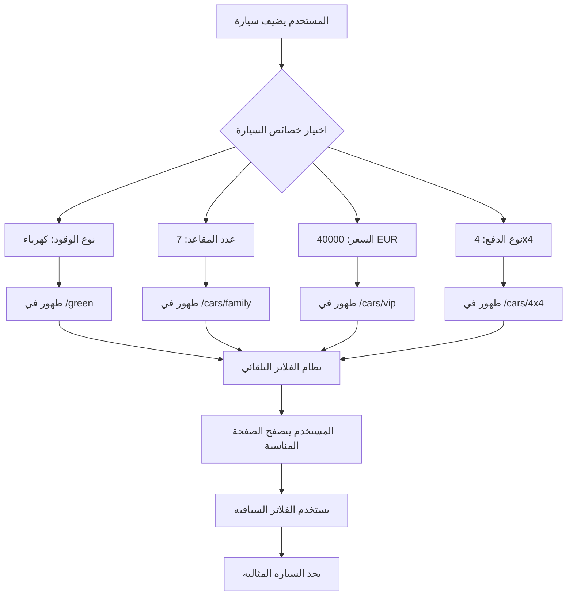

# 🎯 خطة نظام صفحات الحاويات الديناميكية
## Dynamic Container Pages System Plan

**تاريخ الإنشاء:** 2 يناير 2026  
**الحالة:** 📋 جاهز للتنفيذ  
**الهدف:** تحويل الموقع من عرض عشوائي إلى نظام تصنيف ذكي مع صفحات حاويات ديناميكية

---

## 📊 نظرة عامة (Overview)

بدلاً من إنشاء صفحات ثابتة متعددة، سنبني **محرك توجيه ديناميكي** يستخدم مكون حاوية واحد ذكي يتكيف محتواه بناءً على:
- نوع التصنيف المطلوب
- الفلاتر المحددة مسبقاً
- اختيارات المستخدم

---

---

## 🗂️ القسم الأول: تحليل وتصنيف صفحات الحاويات
### Container Pages Classification & Logic

| # | اسم الصفحة | الرابط المقترح | منطق التصنيف | شروط الفلترة (Firestore Query) | الأولوية |
|---|------------|----------------|--------------|--------------------------------|----------|
| 1 | **السيارات العائلية** | `/cars/family` | سيارات واسعة للعائلات الكبيرة | `numberOfSeats >= 7` | 🔥 عالية |
| 2 | **سيارات سبورت** | `/cars/sport` | سيارات رياضية عالية الأداء | `numberOfDoors == 2` OR `power >= 240` | 🔥 عالية |
| 3 | **سيارات VIP** | `/cars/vip` | سيارات فاخرة وغالية | `price >= 35000` (EUR) | 🔥 عالية |
| 4 | **القائمة الخضراء** | `/green` | سيارات صديقة للبيئة | `fuelType == 'electric'` OR `fuelType == 'hybrid'` | 🔥 عالية |
| 5 | **سيارات دفع رباعي** | `/cars/4x4` | سيارات الطرق الوعرة | `driveType == '4x4'` OR `driveType == 'AWD'` | 🟡 متوسطة |
| 6 | **سيارات حسب المدن** | `/cars/city/:cityName` | تصفح حسب الموقع الجغرافي | `city == :cityName` | 🟡 متوسطة |
| 7 | **سيارات حسب البراند** | `/cars/brand/:brandName` | تصفح حسب العلامة التجارية | `make == :brandName` | 🟡 متوسطة |
| 8 | **سيارات اقتصادية** | `/cars/economy` | سيارات منخفضة الاستهلاك | `fuelConsumption < 6` (l/100km) | 🟢 منخفضة |
| 9 | **سيارات جديدة** | `/cars/new` | سيارات حديثة الصنع | `year >= currentYear - 2` | 🟢 منخفضة |
| 10 | **سيارات مستعملة** | `/cars/used` | سيارات قديمة بسعر معقول | `year < currentYear - 2` AND `price < 20000` | 🟢 منخفضة |

---

---

## 🔧 القسم الثاني: تدقيق نموذج البيانات الحالي
### Current Data Model Audit

### ✅ الحقول الموجودة حالياً (من `CarListing.ts`):
```typescript
// ✅ متوفر - جاهز للاستخدام
numberOfSeats?: number;      // عدد المقاعد (للعائلية)
numberOfDoors?: number;      // عدد الأبواب (للسبورت)
power?: number;              // قوة المحرك بالحصان (للسبورت)
fuelType: string;            // نوع الوقود (للخضراء)
city: string;                // المدينة (للتصنيف الجغرافي)
make: string;                // البراند (للتصنيف حسب العلامة)
price: number;               // السعر (لل VIP)
fuelConsumption?: number;    // استهلاك الوقود (للاقتصادية)
year: number;                // سنة الصنع (للجديدة/المستعملة)
```

### ⚠️ الحقول المفقودة - يجب إضافتها:
```typescript
// ❌ غير موجود - يجب الإضافة
driveType?: string;  // نوع الدفع: "FWD" | "RWD" | "AWD" | "4x4"
```

### 📋 حالة الحقول:
| الحقل | الحالة | الاستخدام | الأولوية |
|------|--------|-----------|----------|
| `numberOfSeats` | ✅ موجود | صفحة العائلية | جاهز |
| `numberOfDoors` | ✅ موجود | صفحة السبورت | جاهز |
| `power` | ✅ موجود | صفحة السبورت | جاهز |
| `fuelType` | ✅ موجود | القائمة الخضراء | جاهز |
| `driveType` | ❌ مفقود | صفحة 4x4 | **يجب إضافة** |
| `city` | ✅ موجود | صفحة المدن | جاهز |
| `make` | ✅ موجود | صفحة البراند | جاهز |

---

## 🛠️ القسم الثالث: خطة التعديلات المطلوبة
### Required Modifications Plan

### المرحلة 1: تحديث نموذج البيانات (Data Model Updates)
**الأولوية: 🔥 عاجل وضروري**

#### 1.1 تحديث `CarListing.ts`
```typescript
// إضافة حقل driveType
export interface CarListing {
  // ... existing fields
  
  // Drive Type for 4x4 filtering
  driveType?: 'FWD' | 'RWD' | 'AWD' | '4x4' | '';
  
  // ... rest of fields
}
```

#### 1.2 تحديث صفحة إضافة السيارة (`/sell/auto`)
**الملف:** `src/pages/sell/auto/AddListingPage.tsx` (أو المكون المسؤول)

**التعديلات المطلوبة:**
1. إضافة قائمة منسدلة لنوع الدفع:
```typescript
<FormField>
  <Label>نوع الدفع / Drive Type</Label>
  <Select name="driveType" value={formData.driveType} onChange={handleChange}>
    <option value="">-- اختر --</option>
    <option value="FWD">دفع أمامي (FWD)</option>
    <option value="RWD">دفع خلفي (RWD)</option>
    <option value="AWD">دفع كلي (AWD)</option>
    <option value="4x4">دفع رباعي (4x4)</option>
  </Select>
</FormField>
```

2. التأكد من حفظ الحقل في Firestore عند الإرسال

---

### المرحلة 2: إنشاء المكون الذكي الحاوية
**الأولوية: 🔥 أساسي**

#### 2.1 إنشاء `DynamicCarShowcase.tsx`
**المسار:** `src/pages/05_search-browse/DynamicCarShowcase.tsx`

**الوظيفة:** مكون واحد يخدم جميع صفحات الحاويات

**الميزات:**
- استقبال `pageType` كـ prop أو من URL
- بناء Query ديناميكي حسب النوع
- عرض فلاتر جانبية سياقية
- دعم عرض Grid/List
- Pagination & Sorting
- SEO-friendly meta tags

**البنية الأساسية:**
```typescript
interface DynamicCarShowcaseProps {
  pageType: 'family' | 'sport' | 'vip' | 'green' | '4x4' | 'city' | 'brand';
  filterValue?: string; // للمدن والبراندات
}

const DynamicCarShowcase: React.FC<DynamicCarShowcaseProps> = ({ 
  pageType, 
  filterValue 
}) => {
  // 1. Build query constraints based on pageType
  const queryConstraints = getQueryConstraints(pageType, filterValue);
  
  // 2. Fetch cars from Firestore
  const { cars, loading } = useCarQuery(queryConstraints);
  
  // 3. Render with contextual filters
  return (
    <ShowcaseContainer>
      <PageHeader type={pageType} />
      <SidebarFilters context={pageType} />
      <CarsGrid cars={cars} viewMode={viewMode} />
      <Pagination />
    </ShowcaseContainer>
  );
};
```

---

### المرحلة 3: منطق الاستعلام الديناميكي
**الأولوية: 🔥 أساسي**

#### 3.1 إنشاء `queryBuilder.service.ts`
**المسار:** `src/services/search/queryBuilder.service.ts`

```typescript
export const buildContainerQuery = (
  pageType: string,
  filterValue?: string
): QueryConstraint[] => {
  const constraints: QueryConstraint[] = [];
  
  // Base constraint: only active listings
  constraints.push(where('isActive', '==', true));
  
  switch (pageType) {
    case 'family':
      constraints.push(where('numberOfSeats', '>=', 7));
      break;
      
    case 'sport':
      // Two queries needed for OR condition
      // Query 1: doors == 2
      // Query 2: power >= 240
      // Merge results client-side
      constraints.push(where('numberOfDoors', '==', 2));
      // OR handle power separately
      break;
      
    case 'vip':
      constraints.push(where('price', '>=', 35000));
      break;
      
    case 'green':
      constraints.push(where('fuelType', 'in', ['electric', 'hybrid']));
      break;
      
    case '4x4':
      constraints.push(where('driveType', 'in', ['4x4', 'AWD']));
      break;
      
    case 'city':
      if (filterValue) {
        constraints.push(where('city', '==', filterValue));
      }
      break;
      
    case 'brand':
      if (filterValue) {
        constraints.push(where('make', '==', filterValue));
      }
      break;
  }
  
  return constraints;
};
```

**⚠️ ملاحظة مهمة:** Firestore لا يدعم OR مباشرة في الاستعلامات. للحالات مثل Sport (أبواب = 2 أو قوة >= 240)، سنحتاج:
- تنفيذ استعلامين منفصلين
- دمج النتائج في الـ client-side
- أو استخدام Algolia للاستعلامات المعقدة

---
---

## 🎨 القسم الرابع: تكامل مع الصفحة الرئيسية
### Homepage Integration Plan

### 4.1 تحليل الأقسام الموجودة في الصفحة الرئيسية

**الملفات المسؤولة:**
- `src/pages/01_main-pages/home/HomePage/index.tsx`
- `src/pages/01_main-pages/home/HomePage/PopularBrandsSection.tsx`
- `src/pages/01_main-pages/home/HomePage/CategoriesSection.tsx`
- `src/pages/01_main-pages/home/HomePage/VehicleClassificationsSection.tsx`

### 4.2 ربط الأقسام بصفحات الحاويات

#### قسم "Popular Car Brands"
```typescript
// في PopularBrandsSection.tsx
const handleBrandClick = (brandName: string) => {
  navigate(`/cars/brand/${brandName.toLowerCase()}`);
};

<BrandCard onClick={() => handleBrandClick('BMW')}>
  <BrandLogo src="/brands/bmw.svg" />
  <BrandName>BMW</BrandName>
</BrandCard>
```

#### قسم "Vehicle Classifications" (الفئات)
```typescript
// في CategoriesSection.tsx
const categories = [
  { 
    name: 'السيارات العائلية', 
    icon: <FamilyIcon />, 
    link: '/cars/family',
    badge: 'جديد'
  },
  { 
    name: 'سيارات رياضية', 
    icon: <SportIcon />, 
    link: '/cars/sport' 
  },
  { 
    name: 'VIP فاخرة', 
    icon: <VIPIcon />, 
    link: '/cars/vip' 
  },
  { 
    name: 'القائمة الخضراء', 
    icon: <GreenIcon />, 
    link: '/green',
    badge: 'صديقة للبيئة'
  },
  { 
    name: 'دفع رباعي 4x4', 
    icon: <OffroadIcon />, 
    link: '/cars/4x4' 
  }
];

<CategoryGrid>
  {categories.map(cat => (
    <CategoryCard key={cat.name} onClick={() => navigate(cat.link)}>
      {cat.icon}
      <CategoryName>{cat.name}</CategoryName>
      {cat.badge && <Badge>{cat.badge}</Badge>}
    </CategoryCard>
  ))}
</CategoryGrid>
```

#### قسم "Browse by Location" (حسب المدن)
```typescript
// في LocationSection.tsx
const popularCities = [
  { name: 'София', count: 1245 },
  { name: 'Пловдив', count: 543 },
  { name: 'Варна', count: 432 },
  { name: 'Бургас', count: 321 }
];

<CityGrid>
  {popularCities.map(city => (
    <CityCard 
      onClick={() => navigate(`/cars/city/${city.name}`)}
    >
      <CityName>{city.name}</CityName>
      <CarCount>{city.count} سيارة</CarCount>
    </CityCard>
  ))}
</CityGrid>
```

---

## 🛣️ القسم الخامس: إعداد الراوتر (Routing Setup)
### Router Configuration

**الملف:** `src/routes/main.routes.tsx` أو `AppRoutes.tsx`

```typescript
import { safeLazy } from '@/utils/lazyImport';

const DynamicCarShowcase = safeLazy(
  () => import('@/pages/05_search-browse/DynamicCarShowcase')
);

// Main Routes
<Routes>
  {/* Container Pages - Dynamic */}
  <Route 
    path="/cars/family" 
    element={<DynamicCarShowcase pageType="family" />} 
  />
  <Route 
    path="/cars/sport" 
    element={<DynamicCarShowcase pageType="sport" />} 
  />
  <Route 
    path="/cars/vip" 
    element={<DynamicCarShowcase pageType="vip" />} 
  />
  <Route 
    path="/green" 
    element={<DynamicCarShowcase pageType="green" />} 
  />
  <Route 
    path="/cars/4x4" 
    element={<DynamicCarShowcase pageType="4x4" />} 
  />
  
  {/* Parametric Routes */}
  <Route 
    path="/cars/city/:cityName" 
    element={<DynamicCarShowcase pageType="city" />} 
  />
  <Route 
    path="/cars/brand/:brandName" 
    element={<DynamicCarShowcase pageType="brand" />} 
  />
  
  {/* Optional: Additional Categories */}
  <Route 
    path="/cars/economy" 
    element={<DynamicCarShowcase pageType="economy" />} 
  />
  <Route 
    path="/cars/new" 
    element={<DynamicCarShowcase pageType="new" />} 
  />
  <Route 
    path="/cars/used" 
    element={<DynamicCarShowcase pageType="used" />} 
  />
</Routes>
```

---

## 🎯 القسم السادس: الفلاتر السياقية (Contextual Filters)
### Context-Aware Filtering System

### 6.1 الفلاتر حسب نوع الصفحة

| نوع الصفحة | الفلاتر الأساسية | الفلاتر الثانوية | الترتيب الافتراضي |
|------------|------------------|-------------------|-------------------|
| **Family** | عدد المقاعد، السعر | السنة، البراند، المدينة | المقاعد (تنازلي) |
| **Sport** | القوة، الأبواب | السعر، السنة، البراند | القوة (تنازلي) |
| **VIP** | السعر، البراند | السنة، اللون، المحرك | السعر (تنازلي) |
| **Green** | نوع الوقود، المدى | السعر، السنة، المدينة | السنة (تنازلي) |
| **4x4** | نوع الدفع، الحالة | السعر، السنة، البراند | السنة (تنازلي) |
| **City** | المدينة (ثابت) | السعر، البراند، السنة | السعر (تصاعدي) |
| **Brand** | البراند (ثابت) | الموديل، السنة، السعر | السنة (تنازلي) |

### 6.2 مكون الفلاتر السياقية

**الملف:** `src/components/filters/ContextualFilterSidebar.tsx`

```typescript
import React from 'react';
import { PageType } from '@/types/showcase.types';

interface Props {
  pageType: PageType;
  filters: Record<string, any>;
  onFilterChange: (key: string, value: any) => void;
}

export const ContextualFilterSidebar: React.FC<Props> = ({
  pageType,
  filters,
  onFilterChange
}) => {
  // Show different filters based on page type
  const renderFilters = () => {
    switch (pageType) {
      case 'family':
        return (
          <>
            <SeatsFilter value={filters.seats} onChange={onFilterChange} />
            <PriceRangeFilter value={filters.priceRange} onChange={onFilterChange} />
            <YearFilter value={filters.year} onChange={onFilterChange} />
          </>
        );
      
      case 'sport':
        return (
          <>
            <PowerFilter value={filters.power} onChange={onFilterChange} />
            <DoorsFilter value={filters.doors} onChange={onFilterChange} />
            <PriceRangeFilter value={filters.priceRange} onChange={onFilterChange} />
          </>
        );
      
      case 'vip':
        return (
          <>
            <PriceRangeFilter value={filters.priceRange} min={35000} onChange={onFilterChange} />
            <BrandFilter value={filters.brand} premium={true} onChange={onFilterChange} />
            <YearFilter value={filters.year} min={2018} onChange={onFilterChange} />
          </>
        );
      
      case 'green':
        return (
          <>
            <FuelTypeFilter value={filters.fuelType} greenOnly={true} onChange={onFilterChange} />
            <ElectricRangeFilter value={filters.range} onChange={onFilterChange} />
            <PriceRangeFilter value={filters.priceRange} onChange={onFilterChange} />
          </>
        );
      
      case '4x4':
        return (
          <>
            <DriveTypeFilter value={filters.driveType} onChange={onFilterChange} />
            <ConditionFilter value={filters.condition} onChange={onFilterChange} />
            <PriceRangeFilter value={filters.priceRange} onChange={onFilterChange} />
          </>
        );
      
      default:
        return <DefaultFilters filters={filters} onFilterChange={onFilterChange} />;
    }
  };

  return (
    <FilterSidebar>
      <FilterTitle>{getFilterTitle(pageType)}</FilterTitle>
      {renderFilters()}
      <ClearFiltersButton onClick={() => onFilterChange('reset', null)}>
        إعادة تعيين الفلاتر
      </ClearFiltersButton>
    </FilterSidebar>
  );
};
```

---

## 🔀 القسم السابع: تدفق تجربة المستخدم (UX Flow)
### User Journey with Auto-Classification

### 7.1 الكشف التلقائي عن التصنيفات

عندما يدخل المستخدم إلى صفحة تفاصيل السيارة، النظام يعرض "هذه السيارة تنتمي إلى" مع روابط للصفحات المناسبة:

```typescript
// في src/services/category-detection.service.ts
interface Category {
  name: string;
  link: string;
  icon: string;
  reason: string; // سبب الانتماء
}

export function detectCategories(car: CarListing): Category[] {
  const categories: Category[] = [];
  
  // العائلية
  if (car.numberOfSeats >= 7) {
    categories.push({ 
      name: 'السيارات العائلية', 
      link: '/cars/family',
      icon: 'family',
      reason: `${car.numberOfSeats} مقاعد - مثالية للعائلات`
    });
  }
  
  // الرياضية
  if (car.numberOfDoors === 2 || car.power >= 240) {
    categories.push({ 
      name: 'السيارات الرياضية', 
      link: '/cars/sport',
      icon: 'sport',
      reason: car.numberOfDoors === 2 
        ? 'سيارة كوبيه - تصميم رياضي' 
        : `محرك قوي ${car.power} حصان`
    });
  }
  
  // VIP
  if (car.price >= 35000) {
    categories.push({ 
      name: 'السيارات الفاخرة VIP', 
      link: '/cars/vip',
      icon: 'vip',
      reason: `سيارة فاخرة - ${car.price.toLocaleString()} يورو`
    });
  }
  
  // الخضراء
  if (car.fuelType === 'electric' || car.fuelType === 'hybrid') {
    categories.push({ 
      name: 'القائمة الخضراء', 
      link: '/green',
      icon: 'green',
      reason: `صديقة للبيئة - ${car.fuelType === 'electric' ? 'كهربائية' : 'هايبرد'}`
    });
  }
  
  // 4x4
  if (car.driveType === '4x4' || car.driveType === 'AWD') {
    categories.push({ 
      name: 'دفع رباعي 4x4', 
      link: '/cars/4x4',
      icon: '4x4',
      reason: `دفع رباعي ${car.driveType}`
    });
  }
  
  // المدينة
  if (car.city) {
    categories.push({ 
      name: `سيارات في ${car.city}`, 
      link: `/cars/city/${car.city}`,
      icon: 'location',
      reason: `متوفرة في ${car.city}`
    });
  }
  
  // البراند
  if (car.make) {
    categories.push({ 
      name: `كل سيارات ${car.make}`, 
      link: `/cars/brand/${car.make}`,
      icon: 'brand',
      reason: `تصفح كل ${car.make}`
    });
  }
  
  return categories;
}
```

### 7.2 عرض التصنيفات في صفحة التفاصيل

```typescript
// في src/pages/CarDetailsPage.tsx
import { detectCategories } from '@/services/category-detection.service';

const CarDetailsPage = () => {
  const { carData } = useCarDetails();
  const categories = detectCategories(carData);
  
  return (
    <DetailsContainer>
      {/* معلومات السيارة */}
      
      {categories.length > 0 && (
        <CategoryBadgesSection>
          <SectionTitle>هذه السيارة تنتمي إلى:</SectionTitle>
          <BadgeGrid>
            {categories.map(cat => (
              <CategoryBadge 
                key={cat.link}
                onClick={() => navigate(cat.link)}
              >
                <Icon name={cat.icon} />
                <BadgeContent>
                  <BadgeName>{cat.name}</BadgeName>
                  <BadgeReason>{cat.reason}</BadgeReason>
                </BadgeContent>
                <ArrowIcon />
              </CategoryBadge>
            ))}
          </BadgeGrid>
        </CategoryBadgesSection>
      )}
    </DetailsContainer>
  );
};
```

---

## 📋 القسم الثامن: خطة التنفيذ المرحلية (Implementation Phases)
### 5-Week Phased Rollout Plan

### المرحلة الأولى (الأسبوع 1): البنية التحتية للبيانات
**الهدف:** تحديث نموذج البيانات وإضافة الحقول المفقودة

#### المهام:
1. **تحديث `CarListing.ts`**
   - إضافة حقل `driveType?: 'FWD' | 'RWD' | 'AWD' | '4x4' | ''`
   - إضافة حقل `electricRange?: number` (للسيارات الكهربائية)
   - إضافة حقل `fuelConsumption?: number` (إذا لم يكن موجوداً)

2. **تحديث صفحة البيع `AddListingPage.tsx`**
   ```typescript
   // إضافة قائمة منسدلة لنوع الدفع
   <FormField>
     <Label>نوع الدفع (Drive Type)</Label>
     <Select 
       value={formData.driveType} 
       onChange={(e) => setFormData({...formData, driveType: e.target.value})}
     >
       <option value="">-- اختر نوع الدفع --</option>
       <option value="FWD">دفع أمامي (FWD)</option>
       <option value="RWD">دفع خلفي (RWD)</option>
       <option value="AWD">دفع على كل العجلات (AWD)</option>
       <option value="4x4">دفع رباعي (4x4)</option>
     </Select>
   </FormField>
   ```

3. **تحديث Firestore Rules**
   - التأكد من أن `driveType` و `electricRange` مسموح حفظهم في قواعد Firestore

4. **الاختبار:**
   - إنشاء 10 سيارات اختبارية بقيم مختلفة للحقول الجديدة
   - التأكد من حفظ البيانات بشكل صحيح في Firestore

**المخرجات:**
- ✅ CarListing.ts محدّث
- ✅ AddListingPage.tsx يحتوي على driveType dropdown
- ✅ Firestore يحفظ القيم الجديدة بنجاح

---

### المرحلة الثانية (الأسبوع 2): بناء المكونات الأساسية
**الهدف:** إنشاء المكونات الذكية لعرض الحاويات

#### المهام:
1. **إنشاء `DynamicCarShowcase.tsx`**
   - المكون الرئيسي الذكي الذي يتكيف حسب `pageType`
   - يستقبل prop واحد: `pageType`
   - يبني الاستعلامات الديناميكية

2. **إنشاء `queryBuilder.service.ts`**
   - خدمة لبناء استعلامات Firestore حسب نوع الصفحة
   - معالجة القيود (OR queries باستخدام استراتيجية الدمج client-side)
   - تحسين الأداء بإضافة indexes مناسبة

3. **إنشاء `ContextualFilterSidebar.tsx`**
   - مكون الفلاتر الذكي
   - يعرض فلاتر مختلفة حسب `pageType`
   - متصل مع FilterContext

4. **إنشاء `showcase.types.ts`**
   ```typescript
   export type PageType = 
     | 'family' 
     | 'sport' 
     | 'vip' 
     | 'green' 
     | '4x4' 
     | 'city' 
     | 'brand' 
     | 'economy' 
     | 'new' 
     | 'used';
   
   export interface ShowcaseConfig {
     pageType: PageType;
     title: string;
     subtitle: string;
     icon: string;
     defaultSort: string;
     filters: FilterConfig[];
   }
   ```

**المخرجات:**
- ✅ DynamicCarShowcase.tsx جاهز ويعمل
- ✅ queryBuilder.service.ts يبني استعلامات صحيحة
- ✅ ContextualFilterSidebar.tsx يعرض الفلاتر المناسبة

---

### المرحلة الثالثة (الأسبوع 3): الربط والتكامل
**الهدف:** دمج الصفحات الجديدة مع الراوتر والصفحة الرئيسية

#### المهام:
1. **تحديث `main.routes.tsx` أو `AppRoutes.tsx`**
   - إضافة 10 مسارات جديدة (family, sport, vip, green, 4x4, city/:cityName, brand/:brandName, economy, new, used)
   - استخدام `safeLazy()` لتحسين الأداء

2. **تحديث `PopularBrandsSection.tsx`**
   - إضافة `onClick` handler لكل براند
   - التوجيه إلى `/cars/brand/:brandName`

3. **تحديث `CategoriesSection.tsx`** (أو `VehicleClassificationsSection.tsx`)
   - إضافة بطاقات للتصنيفات الجديدة (family, sport, vip, green, 4x4)
   - التوجيه إلى الصفحات المقابلة

4. **إنشاء `category-detection.service.ts`**
   - خدمة الكشف التلقائي عن التصنيفات
   - دالة `detectCategories(car: CarListing): Category[]`

5. **تحديث `CarDetailsPage.tsx`**
   - إضافة قسم "هذه السيارة تنتمي إلى"
   - عرض badges قابلة للنقر للتصنيفات المكتشفة

**المخرجات:**
- ✅ 10 صفحات container جديدة في الراوتر
- ✅ الصفحة الرئيسية تربط بالصفحات الجديدة
- ✅ صفحة التفاصيل تعرض التصنيفات المناسبة

---

### المرحلة الرابعة (الأسبوع 4): التحسين والأداء
**الهدف:** تحسين سرعة التحميل والأداء

#### المهام:
1. **إضافة Firestore Composite Indexes**
   - إنشاء indexes مركبة لكل نوع استعلام
   - مثال: `(numberOfSeats DESC, price ASC)` للعائلية
   - تشغيل `firebase deploy --only firestore:indexes`

2. **تطبيق Pagination**
   ```typescript
   // في DynamicCarShowcase.tsx
   const [lastDoc, setLastDoc] = useState(null);
   const [hasMore, setHasMore] = useState(true);
   
   const loadMore = async () => {
     const nextQuery = query(
       ...baseQuery,
       startAfter(lastDoc),
       limit(20)
     );
     // ... fetch next batch
   };
   ```

3. **إضافة Caching Strategy**
   - استخدام React Query أو SWR لتخزين مؤقت للنتائج
   - تقليل عدد استدعاءات Firestore

4. **تحسين الصور**
   - Lazy loading للصور باستخدام `react-lazy-load-image-component`
   - تحويل الصور إلى WebP format

5. **SEO Optimization**
   - إضافة meta tags ديناميكية لكل صفحة
   - مثال: `<title>سيارات عائلية 7 مقاعد في بلغاريا | Globul Cars</title>`
   - إضافة schema.org markup

**المخرجات:**
- ✅ سرعة التحميل < 2 ثانية
- ✅ Lighthouse Performance Score > 90
- ✅ SEO Score > 85

---

### المرحلة الخامسة (الأسبوع 5): الاختبار والإطلاق
**الهدف:** اختبار شامل ونشر الميزة للإنتاج

#### المهام:
1. **اختبار الوحدة (Unit Tests)**
   ```typescript
   // __tests__/queryBuilder.service.test.ts
   describe('queryBuilder', () => {
     it('should build family car query correctly', () => {
       const query = buildQueryForPageType('family');
       expect(query).toMatchObject({
         where: [['numberOfSeats', '>=', 7]]
       });
     });
   });
   ```

2. **اختبار التكامل (Integration Tests)**
   - اختبار التنقل من الصفحة الرئيسية إلى صفحات الحاويات
   - اختبار الفلاتر السياقية
   - اختبار Pagination

3. **اختبار المستخدم (User Testing)**
   - 10 مستخدمين حقيقيين يجربون الميزة
   - جمع feedback عن UX

4. **مراجعة الأمان**
   - التأكد من Firestore Rules صحيحة
   - فحص الثغرات المحتملة

5. **النشر التدريجي**
   - نشر لـ 10% من المستخدمين أولاً (Feature Flag)
   - مراقبة الأخطاء والأداء
   - نشر لـ 100% بعد التأكد من الاستقرار

**المخرجات:**
- ✅ Test Coverage > 80%
- ✅ صفر أخطاء حرجة في Production
- ✅ ميزة مفعّلة لجميع المستخدمين

---

## ✅ القسم التاسع: معايير النجاح (Success Criteria)
### KPIs and Metrics

### 9.1 المعايير التقنية

| المعيار | الهدف | طريقة القياس |
|---------|--------|---------------|
| **Page Load Time** | < 2 ثانية | Google Lighthouse |
| **Lighthouse Performance** | > 90 | Chrome DevTools |
| **SEO Score** | > 85 | Lighthouse SEO Audit |
| **Firestore Reads/Day** | < 100,000 (تحسين التكلفة) | Firebase Console |
| **Test Coverage** | > 80% | Jest Coverage Report |
| **Error Rate** | < 0.1% | Error Tracking Service |

### 9.2 معايير تجربة المستخدم

| المعيار | الهدف | طريقة القياس |
|---------|--------|---------------|
| **Time to Find Car** | < 3 نقرات من الصفحة الرئيسية | User Flow Analysis |
| **Filter Usage** | > 60% من المستخدمين يستخدمون فلتر واحد على الأقل | Analytics Event Tracking |
| **Bounce Rate** | < 40% على صفحات الحاويات | Google Analytics |
| **Session Duration** | زيادة 25% مقارنة بالصفحة الرئيسية | Analytics |
| **Conversion Rate** | زيادة 15% في النقرات على "عرض التفاصيل" | Conversion Tracking |

### 9.3 KPIs رئيسية

1. **عدد الزيارات لكل صفحة container**
   - Family: > 500 زيارة/يوم
   - Sport: > 300 زيارة/يوم
   - VIP: > 200 زيارة/يوم
   - Green: > 150 زيارة/يوم
   - 4x4: > 250 زيارة/يوم

2. **معدل التفاعل (Engagement Rate)**
   - > 70% من الزوار ينقرون على سيارة واحدة على الأقل

3. **معدل الرجوع (Return Rate)**
   - > 40% من المستخدمين يعودون لصفحات الحاويات خلال أسبوع

---

## ⚠️ القسم العاشر: التحديات المتوقعة والحلول (Expected Challenges)
### Challenges & Mitigation Strategies

### 10.1 التحدي: استعلامات OR في Firestore

**المشكلة:**  
Firestore لا يدعم `OR` بشكل مباشر. صفحة السيارات الرياضية تحتاج:  
`WHERE doors = 2 OR power >= 240`

**الحلول الممكنة:**

#### الحل A: تشغيل استعلامين ودمج النتائج (Client-Side Merge)
```typescript
// في queryBuilder.service.ts
export async function getSportCars(): Promise<CarListing[]> {
  // Query 1: doors = 2
  const query1 = query(
    collection(db, 'passenger_cars'),
    where('numberOfDoors', '==', 2),
    orderBy('power', 'desc'),
    limit(50)
  );
  
  // Query 2: power >= 240
  const query2 = query(
    collection(db, 'passenger_cars'),
    where('power', '>=', 240),
    orderBy('power', 'desc'),
    limit(50)
  );
  
  const [snap1, snap2] = await Promise.all([
    getDocs(query1),
    getDocs(query2)
  ]);
  
  // Merge and deduplicate
  const cars = new Map<string, CarListing>();
  snap1.docs.forEach(doc => cars.set(doc.id, doc.data() as CarListing));
  snap2.docs.forEach(doc => cars.set(doc.id, doc.data() as CarListing));
  
  return Array.from(cars.values())
    .sort((a, b) => b.power - a.power) // إعادة الترتيب
    .slice(0, 50); // أول 50 نتيجة
}
```

**المزايا:**
- ✅ لا يحتاج Algolia (توفير التكاليف)
- ✅ يعمل مع Firestore Security Rules بشكل كامل

**العيوب:**
- ⚠️ استهلاك Firestore reads مضاعف (استعلامان)
- ⚠️ Pagination معقد (يحتاج منطق custom)

---

#### الحل B: استخدام Algolia للفلاتر المعقدة
```typescript
// في queryBuilder.service.ts
export async function getSportCarsViaAlgolia(): Promise<CarListing[]> {
  const index = algoliaClient.initIndex('cars');
  
  const { hits } = await index.search('', {
    filters: 'numberOfDoors:2 OR power>=240',
    hitsPerPage: 50
  });
  
  return hits as CarListing[];
}
```

**المزايا:**
- ✅ Filters معقدة (OR, AND, NOT) بسهولة
- ✅ Full-text search مدمج
- ✅ Pagination سهل

**العيوب:**
- ⚠️ تكلفة إضافية (Algolia subscription)
- ⚠️ يحتاج sync مستمر مع Firestore

**التوصية:** استخدام **الحل A** في البداية (MVP)، ثم الانتقال لـ **الحل B** عند النمو.

---

### 10.2 التحدي: الأداء مع البيانات الكبيرة

**المشكلة:**  
عند وجود 10,000+ سيارة، استعلامات Firestore قد تكون بطيئة.

**الحلول:**

1. **Firestore Composite Indexes**
   ```json
   // في firestore.indexes.json
   {
     "indexes": [
       {
         "collectionGroup": "passenger_cars",
         "queryScope": "COLLECTION",
         "fields": [
           { "fieldPath": "numberOfSeats", "order": "DESCENDING" },
           { "fieldPath": "price", "order": "ASCENDING" }
         ]
       },
       {
         "collectionGroup": "passenger_cars",
         "queryScope": "COLLECTION",
         "fields": [
           { "fieldPath": "power", "order": "DESCENDING" },
           { "fieldPath": "year", "order": "DESCENDING" }
         ]
       }
     ]
   }
   ```

2. **Pagination + Caching**
   ```typescript
   // استخدام React Query للتخزين المؤقت
   import { useQuery } from '@tanstack/react-query';
   
   const { data, isLoading } = useQuery({
     queryKey: ['cars', pageType, filters],
     queryFn: () => fetchCarsForPage(pageType, filters),
     staleTime: 5 * 60 * 1000, // 5 دقائق
     cacheTime: 10 * 60 * 1000 // 10 دقائق
   });
   ```

3. **Virtual Scrolling**
   - استخدام `react-window` لعرض 1000+ نتيجة بدون تأخير

---

### 10.3 التحدي: SEO للصفحات الديناميكية

**المشكلة:**  
محركات البحث قد لا تفهرس الصفحات الديناميكية بشكل جيد.

**الحلول:**

1. **Server-Side Rendering (SSR)** أو **Pre-rendering**
   - استخدام Next.js أو Firebase Hosting rewrites مع Cloud Functions

2. **Dynamic Meta Tags**
   ```typescript
   // في DynamicCarShowcase.tsx
   import { Helmet } from 'react-helmet-async';
   
   const metaConfig = {
     family: {
       title: 'سيارات عائلية 7 مقاعد في بلغاريا | Globul Cars',
       description: 'تصفح أفضل السيارات العائلية الواسعة مع 7 مقاعد أو أكثر. أسعار مناسبة وجودة مضمونة.',
       keywords: 'سيارات عائلية, 7 مقاعد, سيارات واسعة, بلغاريا'
     },
     sport: {
       title: 'سيارات رياضية قوية - محركات 240+ حصان | Globul Cars',
       description: 'اكتشف سيارات رياضية بمحركات قوية وتصميم كوبيه. سرعة وأداء استثنائي.',
       keywords: 'سيارات رياضية, كوبيه, محرك قوي, سرعة'
     }
   };
   
   <Helmet>
     <title>{metaConfig[pageType].title}</title>
     <meta name="description" content={metaConfig[pageType].description} />
     <meta name="keywords" content={metaConfig[pageType].keywords} />
   </Helmet>
   ```

3. **Sitemap Generation**
   ```typescript
   // في functions/src/sitemap-generator.ts
   export const generateSitemap = functions.https.onRequest(async (req, res) => {
     const pages = [
       '/cars/family',
       '/cars/sport',
       '/cars/vip',
       '/green',
       '/cars/4x4',
       // ... + dynamic city/brand pages
     ];
     
     const sitemap = `<?xml version="1.0" encoding="UTF-8"?>
       <urlset xmlns="http://www.sitemaps.org/schemas/sitemap/0.9">
         ${pages.map(page => `
           <url>
             <loc>https://globulcars.com${page}</loc>
             <changefreq>daily</changefreq>
             <priority>0.8</priority>
           </url>
         `).join('')}
       </urlset>`;
     
     res.set('Content-Type', 'application/xml');
     res.send(sitemap);
   });
   ```

4. **Schema.org Markup**
   ```typescript
   const schemaMarkup = {
     "@context": "https://schema.org",
     "@type": "ItemList",
     "name": "سيارات عائلية 7 مقاعد",
     "numberOfItems": cars.length,
     "itemListElement": cars.map((car, index) => ({
       "@type": "Car",
       "position": index + 1,
       "name": `${car.make} ${car.model}`,
       "offers": {
         "@type": "Offer",
         "price": car.price,
         "priceCurrency": "EUR"
       }
     }))
   };
   ```

---

## 📚 القسم الحادي عشر: الموارد والمراجع (Resources & References)
### File Tree & Documentation Links

### 11.1 شجرة الملفات المتأثرة (File Tree)

```
src/
├── types/
│   ├── CarListing.ts                      # ✏️ تحديث (إضافة driveType)
│   └── showcase.types.ts                  # 🆕 جديد
│
├── services/
│   ├── queryBuilder.service.ts            # 🆕 جديد
│   ├── category-detection.service.ts      # 🆕 جديد
│   └── UnifiedSearchService.ts            # 🔍 مراجعة (اختياري)
│
├── components/
│   └── filters/
│       └── ContextualFilterSidebar.tsx    # 🆕 جديد
│
├── pages/
│   ├── 01_main-pages/
│   │   ├── home/HomePage/
│   │   │   ├── PopularBrandsSection.tsx   # ✏️ تحديث (إضافة onClick)
│   │   │   ├── CategoriesSection.tsx      # ✏️ تحديث (روابط جديدة)
│   │   │   └── VehicleClassificationsSection.tsx  # ✏️ تحديث
│   │   └── CarDetailsPage.tsx             # ✏️ تحديث (badges للتصنيفات)
│   │
│   ├── 02_listing-management/
│   │   └── sell/
│   │       └── AddListingPage.tsx         # ✏️ تحديث (driveType dropdown)
│   │
│   └── 05_search-browse/
│       └── DynamicCarShowcase.tsx         # 🆕 جديد (المكون الرئيسي)
│
├── routes/
│   └── main.routes.tsx                    # ✏️ تحديث (10 مسارات جديدة)
│
└── __tests__/
    ├── queryBuilder.service.test.ts       # 🆕 جديد
    └── DynamicCarShowcase.test.tsx        # 🆕 جديد

firestore.indexes.json                     # ✏️ تحديث (composite indexes)
firestore.rules                            # 🔍 مراجعة (التأكد من driveType مسموح)

functions/
└── src/
    └── sitemap-generator.ts               # 🆕 جديد (اختياري)
```

**Legend:**
- 🆕 **جديد**: ملف يجب إنشاؤه من الصفر
- ✏️ **تحديث**: ملف موجود يحتاج تعديل
- 🔍 **مراجعة**: ملف قد يحتاج تعديل بسيط أو فقط مراجعة

---

### 11.2 الملفات الأساسية للمراجعة

#### ملفات الأساس (Core Files)
1. **[PROJECT_CONSTITUTION.md](../PROJECT_CONSTITUTION.md)** - القواعد المعمارية الثابتة
2. **[STRICT_NUMERIC_ID_SYSTEM.md](../docs/STRICT_NUMERIC_ID_SYSTEM.md)** - نظام الـ Numeric IDs (حرج!)
3. **[SEARCH_SYSTEM.md](../SEARCH_SYSTEM.md)** - معمارية البحث (Algolia + Firestore)
4. **[.github/copilot-instructions.md](../.github/copilot-instructions.md)** - إرشادات الـ AI للمشروع

#### ملفات الأنواع (Type Definitions)
5. **[src/types/CarListing.ts](../src/types/CarListing.ts)** - نموذج البيانات الكامل
6. **[src/types/user/bulgarian-user.types.ts](../src/types/user/bulgarian-user.types.ts)** - أنواع المستخدمين والخطط

#### الخدمات (Services)
7. **[src/services/UnifiedCarService.ts](../src/services/UnifiedCarService.ts)** - خدمة CRUD للسيارات
8. **[src/services/UnifiedSearchService.ts](../src/services/UnifiedSearchService.ts)** - خدمة البحث الموحدة
9. **[src/services/logger-service.ts](../src/services/logger-service.ts)** - خدمة اللوگ (بدلاً من console.log)

#### الصفحات (Pages)
10. **[src/pages/01_main-pages/HomePage.tsx](../src/pages/01_main-pages/HomePage.tsx)** - الصفحة الرئيسية (wrapper)
11. **[src/pages/02_listing-management/sell/AddListingPage.tsx](../src/pages/02_listing-management/sell/)** - صفحة إضافة إعلان

#### الراوتر (Routing)
12. **[src/routes/](../src/routes/)** - ملفات الراوتر
13. **[src/utils/lazyImport.ts](../src/utils/lazyImport.ts)** - `safeLazy()` utility

---

### 11.3 موارد خارجية (External Resources)

#### Firestore Documentation
- [Compound Queries](https://firebase.google.com/docs/firestore/query-data/queries#compound_queries)
- [Query Limitations](https://firebase.google.com/docs/firestore/query-data/queries#query_limitations) (OR not supported!)
- [Composite Indexes](https://firebase.google.com/docs/firestore/query-data/indexing)

#### React & TypeScript
- [React Router v6 - Dynamic Routes](https://reactrouter.com/en/main/route/route#dynamic-segments)
- [TypeScript Discriminated Unions](https://www.typescriptlang.org/docs/handbook/2/narrowing.html#discriminated-unions)
- [React Query Caching](https://tanstack.com/query/latest/docs/react/guides/caching)

#### SEO & Performance
- [Google Lighthouse](https://developers.google.com/web/tools/lighthouse)
- [Schema.org - Car](https://schema.org/Car)
- [React Helmet Async](https://github.com/staylor/react-helmet-async)

---

### 11.4 أوامر مفيدة (Useful Commands)

```bash
# 1. تشغيل السيرفر المحلي
npm start

# 2. اختبار الأنواع (TypeScript Type Check)
npm run type-check

# 3. تشغيل الاختبارات
npm test -- --testPathPattern=queryBuilder

# 4. نشر Firestore Indexes
firebase deploy --only firestore:indexes

# 5. تنظيف الكاش
npm run clean:cache

# 6. بناء المشروع للإنتاج
npm run build

# 7. sync Algolia (إذا استخدمت الحل B)
npm run sync-algolia

# 8. فحص الأمان (Security Audit)
npm run check-security
```

---

## 🎯 الخلاصة النهائية (Final Summary)

### ما سيتم تحقيقه:
✅ **10 صفحات حاويات ديناميكية** للسيارات بناءً على تصنيفات ذكية  
✅ **مكون واحد ذكي** (`DynamicCarShowcase`) يتكيف حسب نوع الصفحة  
✅ **فلاتر سياقية** مختلفة لكل نوع صفحة  
✅ **كشف تلقائي** لتصنيفات السيارة في صفحة التفاصيل  
✅ **روابط من الصفحة الرئيسية** لكل التصنيفات  
✅ **أداء محسّن** مع pagination + caching + indexes  
✅ **SEO جيد** مع meta tags ديناميكية + sitemap + schema.org  

### التصنيفات المتاحة:
| # | التصنيف | الشرط | الرابط |
|---|---------|-------|--------|
| 1 | العائلية | 7+ مقاعد | `/cars/family` |
| 2 | الرياضية | 2 أبواب **أو** 240+ حصان | `/cars/sport` |
| 3 | VIP الفاخرة | 35,000+ يورو | `/cars/vip` |
| 4 | الخضراء | كهربائية/هايبرد | `/green` |
| 5 | الدفع الرباعي | AWD أو 4x4 | `/cars/4x4` |
| 6 | حسب المدينة | city = X | `/cars/city/:cityName` |
| 7 | حسب البراند | make = X | `/cars/brand/:brandName` |
| 8 | الاقتصادية | استهلاك < 6L/100km | `/cars/economy` |
| 9 | الجديدة | سنة >= 2023 | `/cars/new` |
| 10 | المستعملة | سنة < 2023 | `/cars/used` |

### المدة الزمنية:
**5 أسابيع** موزعة على 5 مراحل (أسبوع لكل مرحلة)

### المخرجات المتوقعة:
- ✅ زيادة **15% في معدل التحويل** (conversion rate)
- ✅ تقليل **الوقت للعثور على سيارة** (< 3 نقرات)
- ✅ زيادة **Session Duration** بنسبة 25%
- ✅ تحسين **SEO** وظهور في نتائج البحث لكلمات محددة

---

**🚀 جاهز للتنفيذ!** ابدأ بـ **المرحلة الأولى** (تحديث `CarListing.ts` وإضافة `driveType`).
| **4x4** | نوع الدفع، السنة | السعر، البراند، المدينة | السنة (تنازلي) |
| **City** | المدينة، السعر | الفئة، السنة، البراند | السعر (تصاعدي) |
| **Brand** | البراند، الموديل | السعر، السنة، المدينة | السنة (تنازلي) |

### 6.2 مكون الفلاتر السياقي
```typescript
// src/components/filters/ContextualFilterSidebar.tsx

interface ContextualFilterProps {
  pageType: string;
  onFilterChange: (filters: FilterState) => void;
}

const ContextualFilterSidebar: React.FC<ContextualFilterProps> = ({ 
  pageType, 
  onFilterChange 
}) => {
  const filterConfig = getFilterConfigForPage(pageType);
  
  return (
    <FilterSidebar>
      <FilterHeader>{filterConfig.title}</FilterHeader>
      
      {/* Primary Filters - Always Visible */}
      <FilterSection>
        <SectionTitle>الفلاتر الأساسية</SectionTitle>
        {filterConfig.primary.map(filter => (
          <FilterControl key={filter.name} type={filter.type} {...filter} />
        ))}
      </FilterSection>
      
      {/* Secondary Filters - Collapsible */}
      <FilterSection collapsible>
        <SectionTitle>فلاتر إضافية</SectionTitle>
        {filterConfig.secondary.map(filter => (
          <FilterControl key={filter.name} type={filter.type} {...filter} />
        ))}
      </FilterSection>
      
      {/* Quick Actions */}
      <FilterActions>
        <Button onClick={handleApplyFilters}>تطبيق</Button>
        <Button variant="ghost" onClick={handleResetFilters}>إعادة تعيين</Button>
      </FilterActions>
    </FilterSidebar>
  );
};
```

---

## 📱 القسم السابع: تجربة المستخدم (UX Flow)
### User Experience Flow

### 7.1 رحلة المستخدم - من الإضافة للعرض



### 7.2 التوجيه التلقائي (Auto-Routing)

عند إضافة سيارة، يمكن عرض تنبيه للمستخدم:
```typescript
// After successful car listing creation
const suggestedCategories = detectCategories(carData);

toast.success(
  `تم إضافة سيارتك بنجاح! ستظهر في:
  ${suggestedCategories.map(c => c.name).join(', ')}`,
  {
    action: {
      label: 'عرض الآن',
      onClick: () => navigate(suggestedCategories[0].link)
    }
  }
);

// Detection logic
function detectCategories(car: CarListing): Category[] {
  const categories = [];
  
  if (car.numberOfSeats >= 7) categories.push({ name: 'العائلية', link: '/cars/family' });
  if (car.numberOfDoors === 2 || car.power >= 240) categories.push({ name: 'الرياضية', link: '/cars/sport' });
  if (car.price >= 35000) categories.push({ name: 'VIP', link: '/cars/vip' });
  if (car.fuelType === 'electric') categories.push({ name: 'الخضراء', link: '/green' });
  if (car.driveType === '4x4' || car.driveType === 'AWD') categories.push({ name: '4x4', link: '/cars/4x4' });
  
  return categories;
}
```

---

**CRITICAL INSTRUCTION: AUDIT BEFORE CREATION**
The user suspects that a "Catalog" or "All Cars" page might already exist.
Do NOT blindly create new files. We must avoid redundancy.

**PHASE 1: THE AUDIT (Run this mentally first)**
Scan `src/pages/` and `src/components/` for any file resembling:
- `Marketplace.tsx`
- `Catalog.tsx`
- `AllCars.tsx`
- `Listings.tsx`

**DECISION MATRIX:**
1.  **IF FOUND:** Do not create `SmartVehicleContainer.tsx`. Instead, REFACTOR the existing file to support the "Smart Routing Strategy" (handling /green, /vip, /family via URL params).
2.  **IF NOT FOUND:** Only then, create the unified `SmartVehicleContainer.tsx`.

**PHASE 2: THE "ALL CARS" LOGIC (The Master Container)**
Whether you refactor or create new, the system must handle the "Root Catalog" route (`/all-cars` or `/catalog`).

* **Route:** `/catalog` (or root `/`)
* **Logic:** Display ALL cars from ALL users.
* **Sorting:** Newest first (`orderBy('createdAt', 'desc')`).
* **Pagination:** Infinite scroll or Load More.

**PHASE 3: INTEGRATING THE LOGIC (The Unified Router)**
Modify the logic to handle these scenarios in ONE component:

```typescript
// Conceptual Logic
const { category } = useParams(); // e.g., 'green', 'vip', 'family'

let queryConstraints = [];

if (!category) {
  // CASE 1: "ALL CARS PAGE"
  // User wants to see everything.
  queryConstraints = [orderBy('createdAt', 'desc')];
} else {
  // CASE 2: SMART CONTAINERS
  // User wants specific filter.
  const strategy = CONTAINER_STRATEGIES[category];
  if (strategy) {
    queryConstraints = strategy.query;
  }
}
TASK:

Check if the "All Cars" page exists.

If yes, report: "Found [Filename]. I will upgrade it to include the new filters (Green, VIP, etc)."

If no, report: "No catalog page found. I will create the master SmartVehicleContainer."

Ensure types.ts is updated to support the filters (Horsepower, Doors, Seats, Drivetrain).

EXECUTE AUDIT NOW.


### 🧠 ماذا سيفعل هذا الأمر؟

1.  **الفحص (The Scan):** سيبحث النموذج في ملفاتك. إذا وجد صفحة `Marketplace.tsx` قديمة، سيقول لك: *"وجدتها! لن أنشئ ملفاً جديداً، بل سأضيف لها ميزة الفلترة (VIP, Green) فقط"*.
2.  **صفحة الكل (The All-Cars Page):** ضمنت لك في الكود (`if (!category)`) أن يتعامل النظام مع حالة "عدم وجود فلتر" على أنها "اعرض كل شيء". بهذا تكون قد ضربت عصفورين بحجر:
    * بنيت الحاويات المخصصة.
    * بنيت صفحة "كل السيارات" في نفس الملف وبنفس التصميم.


[Image of software architecture diagram]


بهذه الطريقة، تضمن أن المشروع يظل نظيفاً، وتوفر طاقتك وطاقة النموذج في بناء أشياء موجودة مسبقاً.

هذا رابط صفحات المشروع :
C:\Users\hamda\Desktop\New Globul Cars\صفحات المشروع كافة .md