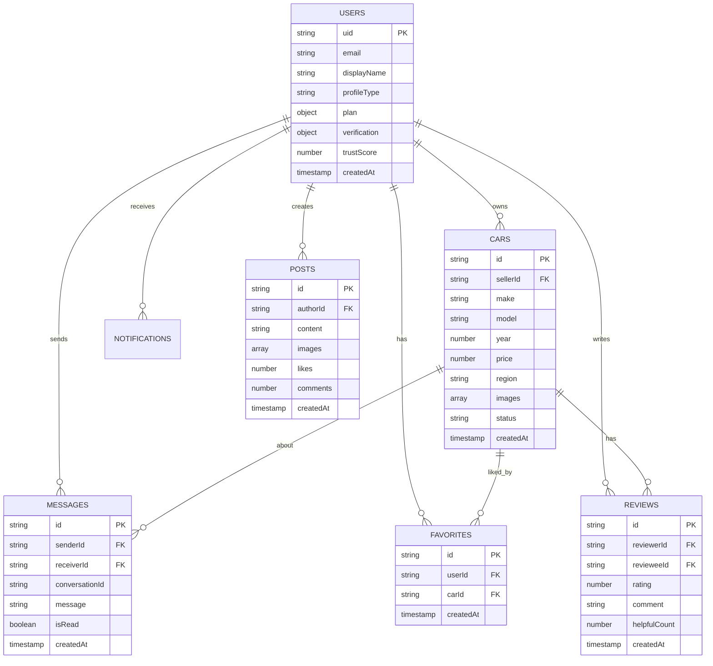

# 📊 مخططات مشروع Globul Cars
## Bulgarian Car Marketplace - Visual Diagrams

**تاريخ الإنشاء:** 24 أكتوبر 2025  
**النوع:** مخططات بصرية شاملة

---

## 📋 جدول المحتويات

1. [مخطط جميع الصفحات](#1-مخطط-جميع-الصفحات)
2. [مخطط مسار البيع](#2-مخطط-مسار-البيع)
3. [مخطط البنية المعمارية](#3-مخطط-البنية-المعمارية)
4. [مخطط تدفق المستخدم](#4-مخطط-تدفق-المستخدم)

---

## 1. مخطط جميع الصفحات

### 🗺️ الخريطة الكاملة للصفحات (85+ صفحة)

```mermaid
graph TB
    Root[Globul Cars<br/>85+ صفحة]
    
    %% Main Categories
    Root --> Main[الصفحات الرئيسية<br/>8 صفحات]
    Root --> Auth[المصادقة<br/>4 صفحات]
    Root --> User[صفحات المستخدم<br/>12 صفحات]
    Root --> Sell[نظام البيع<br/>15+ صفحة]
    Root --> Search[البحث والتصفح<br/>5 صفحات]
    Root --> Admin[الإدارة<br/>4 صفحات]
    Root --> Advanced[متقدمة<br/>9 صفحات]
    Root --> Payment[الدفع<br/>4 صفحات]
    Root --> Dealer[التجار<br/>3 صفحات]
    Root --> Legal[قانونية<br/>5 صفحات]
    Root --> Test[اختبار<br/>7 صفحات]
    
    %% Main Pages
    Main --> M1[/ Homepage]
    Main --> M2[/cars]
    Main --> M3[/cars/:id]
    Main --> M4[/about]
    Main --> M5[/contact]
    Main --> M6[/help]
    
    %% Auth Pages
    Auth --> A1[/login]
    Auth --> A2[/register]
    Auth --> A3[/verification]
    Auth --> A4[/oauth/callback]
    
    %% User Pages
    User --> U1[/profile]
    User --> U2[/users]
    User --> U3[/my-listings]
    User --> U4[/my-drafts]
    User --> U5[/edit-car/:id]
    User --> U6[/messages]
    User --> U7[/favorites]
    User --> U8[/notifications]
    User --> U9[/dashboard]
    User --> U10[/create-post]
    
    %% Sell System
    Sell --> S1[/sell]
    Sell --> S2[/sell/auto]
    Sell --> S3[/sell/.../verkaeufertyp]
    Sell --> S4[/sell/.../fahrzeugdaten]
    Sell --> S5[/sell/.../equipment]
    Sell --> S6[/sell/.../bilder]
    Sell --> S7[/sell/.../preis]
    Sell --> S8[/sell/.../contact]
    
    %% Search
    Search --> SR1[/advanced-search]
    Search --> SR2[/top-brands]
    Search --> SR3[/brand-gallery]
    Search --> SR4[/dealers]
    Search --> SR5[/finance]
    
    %% Admin
    Admin --> AD1[/admin-login]
    Admin --> AD2[/admin]
    Admin --> AD3[/super-admin-login]
    Admin --> AD4[/super-admin]
    
    %% Advanced
    Advanced --> AV1[/analytics]
    Advanced --> AV2[/digital-twin]
    Advanced --> AV3[/subscription]
    Advanced --> AV4[/invoices]
    Advanced --> AV5[/commissions]
    Advanced --> AV6[/billing]
    Advanced --> AV7[/verification]
    Advanced --> AV8[/team]
    Advanced --> AV9[/events]
    
    %% Payment
    Payment --> P1[/checkout/:id]
    Payment --> P2[/payment-success/:id]
    Payment --> P3[/billing/success]
    Payment --> P4[/billing/canceled]
    
    %% Dealer
    Dealer --> D1[/dealer/:slug]
    Dealer --> D2[/dealer-registration]
    
    %% Legal
    Legal --> L1[/privacy-policy]
    Legal --> L2[/terms-of-service]
    Legal --> L3[/data-deletion]
    Legal --> L4[/cookie-policy]
    Legal --> L5[/sitemap]
    
    %% Testing
    Test --> T1[/theme-test]
    Test --> T2[/background-test]
    Test --> T3[/full-demo]
    Test --> T4[/effects-test]
    Test --> T5[/n8n-test]
    Test --> T6[/migration]
    Test --> T7[/debug-cars]
    
    %% Styling
    classDef mainClass fill:#ff8f10,stroke:#333,stroke-width:2px,color:#fff
    classDef authClass fill:#4CAF50,stroke:#333,stroke-width:2px,color:#fff
    classDef userClass fill:#2196F3,stroke:#333,stroke-width:2px,color:#fff
    classDef sellClass fill:#FF5722,stroke:#333,stroke-width:2px,color:#fff
    classDef adminClass fill:#9C27B0,stroke:#333,stroke-width:2px,color:#fff
    classDef testClass fill:#607D8B,stroke:#333,stroke-width:2px,color:#fff
    
    class Root mainClass
    class Main,M1,M2,M3,M4,M5,M6 mainClass
    class Auth,A1,A2,A3,A4 authClass
    class User,U1,U2,U3,U4,U5,U6,U7,U8,U9,U10 userClass
    class Sell,S1,S2,S3,S4,S5,S6,S7,S8 sellClass
    class Admin,AD1,AD2,AD3,AD4 adminClass
    class Test,T1,T2,T3,T4,T5,T6,T7 testClass
```

### 📊 تصنيف الصفحات حسب النوع

```
┌─────────────────────────────────────────────┐
│        GLOBUL CARS - 85+ PAGES             │
└─────────────────────────────────────────────┘
                    │
    ┌───────────────┼───────────────┐
    │               │               │
┌───▼────┐    ┌────▼────┐    ┌────▼─────┐
│ PUBLIC │    │PROTECTED│    │  ADMIN   │
│15 Pages│    │  52+    │    │ 4 Pages  │
└────────┘    │ Pages   │    └──────────┘
              └─────────┘
                    │
        ┌───────────┼───────────┐
        │           │           │
    ┌───▼───┐   ┌──▼──┐   ┌───▼────┐
    │ User  │   │Sell │   │Advanced│
    │ 12    │   │ 15+ │   │   9    │
    └───────┘   └─────┘   └────────┘
```

---

## 2. مخطط مسار البيع

### 🚗 رحلة بيع السيارة (7 خطوات - Mobile.de Style)

```mermaid
graph LR
    Start([بدء البيع]) --> Step1[1️⃣ اختيار نوع المركبة<br/>/sell/auto]
    
    Step1 --> Step2[2️⃣ نوع البائع<br/>/verkaeufertyp<br/>فرد/تاجر/شركة]
    
    Step2 --> Step3[3️⃣ بيانات السيارة<br/>/fahrzeugdaten<br/>ماركة/موديل/سنة/كم]
    
    Step3 --> Step4[4️⃣ التجهيزات<br/>/equipment<br/>سلامة/راحة/ترفيه]
    
    Step4 --> Step5[5️⃣ الصور<br/>/bilder<br/>حتى 20 صورة]
    
    Step5 --> Step6[6️⃣ السعر<br/>/preis<br/>السعر والشروط]
    
    Step6 --> Step7[7️⃣ بيانات الاتصال<br/>/contact<br/>هاتف/بريد/عنوان]
    
    Step7 --> Review{مراجعة<br/>الإعلان}
    
    Review -->|تعديل| Step1
    Review -->|نشر| Published([✅ إعلان منشور])
    Review -->|حفظ| Draft([💾 حفظ كمسودة])
    
    Draft -.->|استكمال لاحقاً| Step1
    
    %% Styling
    classDef stepClass fill:#ff8f10,stroke:#333,stroke-width:3px,color:#fff
    classDef startClass fill:#4CAF50,stroke:#333,stroke-width:3px,color:#fff
    classDef endClass fill:#2196F3,stroke:#333,stroke-width:3px,color:#fff
    classDef draftClass fill:#FFC107,stroke:#333,stroke-width:3px,color:#000
    
    class Start startClass
    class Step1,Step2,Step3,Step4,Step5,Step6,Step7 stepClass
    class Published endClass
    class Draft draftClass
```



### 📋 تفاصيل كل خطوة

```
╔════════════════════════════════════════════════════════╗
║           SELL WORKFLOW - 7 STEPS DETAILED            ║
╚════════════════════════════════════════════════════════╝

┌─ STEP 1: نوع المركبة ──────────────────────────────┐
│  Route: /sell/auto                                   │
│  Options:                                            │
│   • 🚗 سيارة                                        │
│   • 🚙 SUV/جيب                                      │
│   • 🚐 فان                                          │
│   • 🏍️ دراجة نارية                                 │
│   • 🚚 شاحنة                                        │
│   • 🚌 حافلة                                        │
└──────────────────────────────────────────────────────┘
                        ⬇️
┌─ STEP 2: نوع البائع ───────────────────────────────┐
│  Route: /sell/inserat/:type/verkaeufertyp           │
│  Options:                                            │
│   👤 خاص (Private)                                  │
│      ├─ بدون ضرائب                                 │
│      └─ رسوم أقل                                   │
│   🏪 تاجر (Dealer)                                  │
│      ├─ خدمات احترافية                             │
│      └─ تمويل                                       │
│   🏢 شركة (Company)                                 │
│      ├─ عدد كبير                                   │
│      └─ شروط خاصة                                  │
└──────────────────────────────────────────────────────┘
                        ⬇️
┌─ STEP 3: بيانات السيارة ───────────────────────────┐
│  Route: /sell/.../fahrzeugdaten/antrieb-und-umwelt  │
│  Fields:                                             │
│   📌 الماركة (435 خيار)                            │
│   📌 الموديل (ديناميكي)                            │
│   📌 السنة (1900-2025)                              │
│   📌 الكيلومترات                                    │
│   📌 نوع الوقود                                     │
│   📌 ناقل الحركة                                    │
│   📌 القوة (HP/KW)                                  │
│   📌 حجم المحرك                                     │
│   📌 اللون                                          │
│   📌 الأبواب/المقاعد                               │
└──────────────────────────────────────────────────────┘
                        ⬇️
┌─ STEP 4: التجهيزات ────────────────────────────────┐
│  Route: /sell/inserat/:type/equipment               │
│  Categories:                                         │
│   🛡️ السلامة                                       │
│      ├─ ABS, ESP, Airbags                           │
│      └─ نظام مساعدة الركن                          │
│   🛋️ الراحة                                        │
│      ├─ تكييف، مقاعد جلد                           │
│      └─ نوافذ كهربائية                             │
│   📱 الترفيه                                        │
│      ├─ GPS, Bluetooth                              │
│      └─ كاميرا خلفية                               │
│   ✨ إضافات                                         │
│      └─ فتحة سقف، عجلات سبائك                     │
└──────────────────────────────────────────────────────┘
                        ⬇️
┌─ STEP 5: الصور ─────────────────────────────────────┐
│  Route: /sell/inserat/:type/details/bilder          │
│  Features:                                           │
│   📸 حتى 20 صورة                                   │
│   🖼️ ترتيب بالسحب والإفلات                        │
│   ✂️ قص وتعديل                                     │
│   🗜️ ضغط تلقائي                                    │
│   📐 أبعاد موحدة                                    │
│   ⭐ تحديد الصورة الرئيسية                         │
└──────────────────────────────────────────────────────┘
                        ⬇️
┌─ STEP 6: السعر ─────────────────────────────────────┐
│  Route: /sell/inserat/:type/details/preis           │
│  Fields:                                             │
│   💶 السعر (EUR)                                    │
│   🔄 قابل للتفاوض                                  │
│   💳 تمويل متاح                                     │
│   🔁 استبدال متاح                                  │
│   ✅ ضمان                                           │
│   📝 وصف السعر                                      │
└──────────────────────────────────────────────────────┘
                        ⬇️
┌─ STEP 7: بيانات الاتصال ───────────────────────────┐
│  Route: /sell/inserat/:type/contact                 │
│  Fields:                                             │
│   👤 الاسم الكامل                                  │
│   📧 البريد الإلكتروني                             │
│   📱 رقم الهاتف                                     │
│   📍 المدينة/المنطقة                               │
│   🗺️ العنوان التفصيلي                             │
│   🕐 ساعات التواصل                                 │
│   💬 طرق التواصل المفضلة                           │
│      ├─ WhatsApp                                    │
│      ├─ Viber                                       │
│      ├─ Telegram                                    │
│      └─ مكالمة/SMS                                 │
└──────────────────────────────────────────────────────┘
                        ⬇️
                  ✅ إعلان جاهز!
```

---

## 3. مخطط البنية المعمارية

### 🏗️ النظام المعماري الكامل

```mermaid
graph TB
    subgraph "👥 User Layer"
        User[المستخدم<br/>Desktop/Mobile]
    end
    
    subgraph "🌐 Frontend Layer"
        React[React 19 App<br/>TypeScript]
        Components[290+ Components]
        Pages[85+ Pages]
        Contexts[5 Contexts]
        
        React --> Components
        React --> Pages
        React --> Contexts
    end
    
    subgraph "🔐 Authentication Layer"
        Auth[Firebase Auth]
        Google[Google OAuth]
        Facebook[Facebook OAuth]
        Twitter[Twitter OAuth]
        Phone[Phone SMS]
        
        Auth --> Google
        Auth --> Facebook
        Auth --> Twitter
        Auth --> Phone
    end
    
    subgraph "⚙️ Business Logic Layer"
        Services[164+ Services]
        Hooks[14 Custom Hooks]
        Utils[17 Utilities]
        
        Services --> Hooks
        Services --> Utils
    end
    
    subgraph "☁️ Backend Layer - Firebase"
        Functions[98+ Cloud Functions]
        Firestore[(Firestore DB<br/>15+ Collections)]
        Storage[(Firebase Storage<br/>Images/Docs)]
        FCM[Cloud Messaging<br/>Push Notifications]
        Analytics[Firebase Analytics]
        
        Functions --> Firestore
        Functions --> Storage
        Functions --> FCM
        Functions --> Analytics
    end
    
    subgraph "🔌 External Services"
        Maps[Google Maps API]
        Stripe[Stripe Payments]
        Social[Social Media APIs<br/>FB/IG/TikTok]
        AI[AI Services<br/>Vision/Translation]
        
        Maps -.-> Functions
        Stripe -.-> Functions
        Social -.-> Functions
        AI -.-> Functions
    end
    
    subgraph "📊 Data Layer"
        CarData[Car Database<br/>435 Brands]
        Cities[Bulgarian Cities<br/>28 Regions]
        Translations[i18n<br/>1700+ Keys]
        
        CarData --> Firestore
        Cities --> Firestore
        Translations --> React
    end
    
    %% Connections
    User --> React
    React --> Auth
    React --> Services
    Services --> Functions
    Functions --> Firestore
    Functions --> Storage
    
    %% Styling
    classDef frontend fill:#ff8f10,stroke:#333,stroke-width:2px,color:#fff
    classDef backend fill:#4CAF50,stroke:#333,stroke-width:2px,color:#fff
    classDef auth fill:#2196F3,stroke:#333,stroke-width:2px,color:#fff
    classDef external fill:#9C27B0,stroke:#333,stroke-width:2px,color:#fff
    classDef data fill:#FF5722,stroke:#333,stroke-width:2px,color:#fff
    
    class React,Components,Pages,Contexts frontend
    class Functions,Firestore,Storage,FCM,Analytics backend
    class Auth,Google,Facebook,Twitter,Phone auth
    class Maps,Stripe,Social,AI external
    class CarData,Cities,Translations data
```



### 📦 التقنيات المستخدمة

```
╔══════════════════════════════════════════════════════╗
║              TECHNOLOGY STACK                        ║
╚══════════════════════════════════════════════════════╝

┌─ Frontend Stack ────────────────────────────────────┐
│  Core:                                               │
│   • React 19.1.1                                    │
│   • TypeScript 4.9.5                                │
│   • Styled Components 6.1.19                        │
│   • React Router 7.9.1                              │
│                                                      │
│  UI/UX:                                             │
│   • Lucide React Icons                              │
│   • Glass Morphism Design                           │
│   • Neumorphism Effects                             │
│   • Mobile-First Responsive                         │
│                                                      │
│  State Management:                                   │
│   • React Context API                               │
│   • Custom Hooks (14)                               │
│   • Local Storage Caching                           │
└──────────────────────────────────────────────────────┘

┌─ Backend Stack ─────────────────────────────────────┐
│  Firebase Services:                                  │
│   • Authentication (Multi-provider)                 │
│   • Cloud Firestore (NoSQL DB)                     │
│   • Cloud Storage (Images/Files)                   │
│   • Cloud Functions (98+)                          │
│   • Cloud Messaging (FCM)                          │
│   • Firebase Analytics                             │
│                                                      │
│  Cloud Functions:                                    │
│   • Node.js/TypeScript                             │
│   • Express.js                                      │
│   • Cron Jobs                                       │
│   • Webhooks                                        │
└──────────────────────────────────────────────────────┘

┌─ External Integrations ─────────────────────────────┐
│  Maps & Location:                                    │
│   • Google Maps API                                 │
│   • Geocoding API                                   │
│   • Places API                                      │
│   • Leaflet (Backup)                               │
│                                                      │
│  Payments:                                          │
│   • Stripe Checkout                                 │
│   • Stripe Subscriptions                           │
│   • Webhooks                                        │
│                                                      │
│  Social Media:                                       │
│   • Facebook (Login, Pixel, Catalog)               │
│   • Instagram API                                   │
│   • TikTok API                                      │
│   • Twitter OAuth                                   │
│                                                      │
│  AI Services:                                        │
│   • Google Vision API                               │
│   • Translation API                                 │
│   • Text-to-Speech                                  │
│   • Custom ML Model (Python)                       │
└──────────────────────────────────────────────────────┘

┌─ Development Tools ─────────────────────────────────┐
│  Build & Bundle:                                     │
│   • React Scripts 5.0                               │
│   • Webpack (under the hood)                       │
│   • Babel Transpiler                               │
│   • Code Splitting                                  │
│                                                      │
│  Quality:                                           │
│   • ESLint                                          │
│   • Prettier                                        │
│   • TypeScript Strict                              │
│   • Jest Testing                                    │
│                                                      │
│  Deployment:                                         │
│   • Firebase Hosting                                │
│   • GitHub Actions CI/CD                           │
│   • Custom Domain (mobilebg.eu)                    │
└──────────────────────────────────────────────────────┘
```

### 🗄️ هيكل قاعدة البيانات



---

## 4. مخطط تدفق المستخدم

### 👤 رحلة المستخدم الكاملة

```mermaid
graph TB
    Start([زائر جديد<br/>يفتح الموقع]) --> Landing{الصفحة<br/>الرئيسية}
    
    Landing -->|تصفح| Browse[تصفح السيارات<br/>/cars]
    Landing -->|بحث| Search[بحث متقدم<br/>/advanced-search]
    Landing -->|بيع| NeedAuth{مسجل دخول؟}
    
    Browse --> CarDetails[تفاصيل السيارة<br/>/cars/:id]
    
    CarDetails --> Action1{ماذا يريد؟}
    Action1 -->|إعجاب| FavAuth{مسجل؟}
    Action1 -->|تواصل| MsgAuth{مسجل؟}
    Action1 -->|مشاركة| Share[مشاركة]
    
    FavAuth -->|نعم| AddFav[إضافة للمفضلة]
    FavAuth -->|لا| Login
    
    MsgAuth -->|نعم| SendMsg[إرسال رسالة]
    MsgAuth -->|لا| Login
    
    NeedAuth -->|نعم| SellFlow[مسار البيع<br/>7 خطوات]
    NeedAuth -->|لا| Login[تسجيل الدخول<br/>/login]
    
    Login --> AuthChoice{طريقة الدخول}
    AuthChoice -->|Email| EmailLogin[بريد/كلمة مرور]
    AuthChoice -->|Google| GoogleAuth[Google OAuth]
    AuthChoice -->|Facebook| FBAuth[Facebook OAuth]
    AuthChoice -->|حساب جديد| Register[إنشاء حساب<br/>/register]
    
    EmailLogin --> Verify{محقق؟}
    GoogleAuth --> Verify
    FBAuth --> Verify
    
    Verify -->|لا| EmailVerify[التحقق من البريد<br/>/verification]
    Verify -->|نعم| Dashboard
    
    EmailVerify --> Dashboard[لوحة التحكم<br/>/dashboard]
    
    Register --> EmailVerify
    
    Dashboard --> UserActions{الإجراءات}
    
    UserActions -->|بروفايل| Profile[الملف الشخصي<br/>/profile]
    UserActions -->|بيع| SellFlow
    UserActions -->|رسائل| Messages[الرسائل<br/>/messages]
    UserActions -->|مفضلة| Favorites[المفضلة<br/>/favorites]
    UserActions -->|إعلاناتي| MyListings[سياراتي<br/>/my-listings]
    UserActions -->|إشعارات| Notifications[الإشعارات<br/>/notifications]
    
    SellFlow --> Step1[1. نوع المركبة]
    Step1 --> Step2[2. نوع البائع]
    Step2 --> Step3[3. بيانات السيارة]
    Step3 --> Step4[4. التجهيزات]
    Step4 --> Step5[5. الصور]
    Step5 --> Step6[6. السعر]
    Step6 --> Step7[7. بيانات الاتصال]
    Step7 --> PublishChoice{نشر/حفظ؟}
    
    PublishChoice -->|نشر| Published[✅ منشور]
    PublishChoice -->|حفظ| Draft[💾 مسودة]
    
    Published --> MyListings
    Draft --> MyDrafts[مسوداتي<br/>/my-drafts]
    
    MyDrafts -.->|استكمال| Step1
    
    MyListings --> EditCar{تعديل/حذف؟}
    EditCar -->|تعديل| EditCarPage[/edit-car/:id]
    EditCar -->|حذف| DeleteCar[حذف]
    
    EditCarPage --> MyListings
    DeleteCar --> MyListings
    
    Messages --> ChatWindow[نافذة الدردشة]
    ChatWindow --> SendMessage[إرسال رسالة]
    
    Profile --> EditProfile{تعديل؟}
    EditProfile -->|نعم| UpdateProfile[تحديث البيانات]
    EditProfile -->|نوع البروفايل| ChangeType{تغيير النوع}
    
    ChangeType -->|Private| SetPrivate[👤 فرد]
    ChangeType -->|Dealer| SetDealer[🏪 تاجر]
    ChangeType -->|Company| SetCompany[🏢 شركة]
    
    UpdateProfile --> Profile
    SetPrivate --> Profile
    SetDealer --> Profile
    SetCompany --> Profile
    
    %% Styling
    classDef public fill:#4CAF50,stroke:#333,stroke-width:2px,color:#fff
    classDef auth fill:#2196F3,stroke:#333,stroke-width:2px,color:#fff
    classDef protected fill:#ff8f10,stroke:#333,stroke-width:2px,color:#fff
    classDef action fill:#9C27B0,stroke:#333,stroke-width:2px,color:#fff
    classDef success fill:#4CAF50,stroke:#333,stroke-width:3px,color:#fff
    
    class Start,Landing,Browse,Search,CarDetails public
    class Login,Register,EmailVerify,GoogleAuth,FBAuth auth
    class Dashboard,Profile,Messages,Favorites,MyListings,SellFlow protected
    class Published success
```

### 🎯 سيناريوهات المستخدم الشائعة

```
╔══════════════════════════════════════════════════════╗
║          USER JOURNEY SCENARIOS                      ║
╚══════════════════════════════════════════════════════╝

┌─ السيناريو 1: مشتري يبحث عن سيارة ────────────────┐
│                                                      │
│  1. يزور الموقع (/)                                │
│  2. يتصفح السيارات (/cars)                         │
│  3. يستخدم الفلاتر (منطقة، سعر، نوع)              │
│  4. يفتح تفاصيل سيارة (/cars/:id)                  │
│  5. يضيفها للمفضلة (يطلب تسجيل دخول)              │
│  6. يسجل دخول (/login)                              │
│  7. يرسل رسالة للبائع                              │
│  8. يتفاوض عبر الرسائل (/messages)                 │
│  9. يحفظ البحث (/saved-searches)                   │
│  10. يشتري السيارة! ✅                              │
│                                                      │
└──────────────────────────────────────────────────────┘

┌─ السيناريو 2: بائع يعرض سيارته ───────────────────┐
│                                                      │
│  1. يزور الموقع (/)                                │
│  2. ينقر "بيع سيارة"                               │
│  3. يطلب منه تسجيل دخول                            │
│  4. يسجل حساب جديد (/register)                     │
│  5. يحقق البريد الإلكتروني                         │
│  6. يبدأ مسار البيع (/sell/auto)                   │
│  7. يختار نوع المركبة (سيارة)                     │
│  8. يحدد نوع البائع (خاص)                         │
│  9. يدخل بيانات السيارة كاملة                     │
│  10. يضيف التجهيزات والميزات                       │
│  11. يرفع 15 صورة للسيارة                          │
│  12. يحدد السعر (€20,000)                          │
│  13. يدخل بيانات الاتصال                           │
│  14. ينشر الإعلان ✅                                │
│  15. يتلقى استفسارات من المشترين                   │
│                                                      │
└──────────────────────────────────────────────────────┘

┌─ السيناريو 3: تاجر يدير معرضه ────────────────────┐
│                                                      │
│  1. يسجل دخول كتاجر                                │
│  2. يذهب لـ /my-listings                            │
│  3. يرى جميع إعلاناته (50 سيارة)                  │
│  4. يضيف سيارة جديدة (مسار سريع)                  │
│  5. يعدل سعر 5 سيارات (تعديل جماعي)               │
│  6. يرد على 10 رسائل (/messages)                   │
│  7. يفحص التحليلات (/analytics)                    │
│     • 1,250 مشاهدة                                  │
│     • 45 استفسار                                    │
│     • 3 مبيعات                                      │
│  8. يدير فريقه (/team)                              │
│  9. يفعّل حملة إعلانية                             │
│  10. يجدد الاشتراك (/subscription)                 │
│                                                      │
└──────────────────────────────────────────────────────┘

┌─ السيناريو 4: زائر غير مسجل ──────────────────────┐
│                                                      │
│  ✅ يمكنه:                                          │
│   • تصفح جميع السيارات                             │
│   • استخدام البحث المتقدم                          │
│   • مشاهدة تفاصيل السيارات                         │
│   • قراءة المعلومات والمراجعات                    │
│   • مشاركة الإعلانات                               │
│                                                      │
│  ❌ لا يمكنه:                                       │
│   • إضافة للمفضلة                                  │
│   • إرسال رسائل للبائعين                           │
│   • بيع سيارة                                       │
│   • حفظ عمليات البحث                               │
│   • رؤية بيانات الاتصال الكاملة                   │
│                                                      │
│  → يطلب منه التسجيل عند محاولة أي إجراء محمي      │
│                                                      │
└──────────────────────────────────────────────────────┘
```

### 📊 إحصائيات تدفق المستخدم

```
┌─────────────────────────────────────────────────┐
│        USER FLOW CONVERSION FUNNEL             │
└─────────────────────────────────────────────────┘

1000 زائر جديد (100%)
    │
    ├─ 750 يتصفحون السيارات (75%)
    │   │
    │   ├─ 500 يفتحون تفاصيل (67%)
    │   │   │
    │   │   └─ 200 يضيفون للمفضلة (40%)
    │   │       │
    │   │       └─ 100 يرسلون رسالة (50%)
    │   │           │
    │   │           └─ 10 يشترون (10%) ✅
    │   │
    │   └─ CONVERSION: 1% شراء من التصفح
    │
    ├─ 150 يبحثون متقدم (15%)
    │   │
    │   └─ 100 يجدون مناسب (67%)
    │       │
    │       └─ 20 يشترون (20%) ✅
    │
    └─ 100 يريدون البيع (10%)
        │
        ├─ 80 يسجلون دخول (80%)
        │   │
        │   └─ 60 يكملون الإعلان (75%)
        │       │
        │       └─ 50 ينشرون (83%) ✅
        │
        └─ CONVERSION: 5% نشر من البيع

OVERALL METRICS:
├─ معدل التسجيل: 25%
├─ معدل إكمال البروفايل: 70%
├─ معدل نشر الإعلانات: 83%
├─ معدل الشراء: 1-2%
└─ معدل العودة: 45%
```

---

## 📝 ملاحظات الاستخدام

### كيف تستخدم هذه المخططات؟

#### 🔷 مخططات Mermaid:
```
1. في GitHub/GitLab:
   ✅ تظهر تلقائياً كمخططات بصرية

2. في VS Code:
   ✅ تثبيت إضافة "Markdown Preview Mermaid Support"
   ✅ اضغط Ctrl+Shift+V لمعاينة

3. على الويب:
   ✅ افتح https://mermaid.live/
   ✅ الصق الكود وشاهد المخطط

4. تصدير كصورة:
   ✅ من mermaid.live اضغط Actions > PNG/SVG
```

#### 🔷 المخططات النصية:
```
✅ تظهر بشكل صحيح في أي محرر نصوص
✅ استخدم خط Monospace للعرض الأفضل
✅ يمكن طباعتها مباشرة
```

---

## 🎨 تخصيص المخططات

### الألوان المستخدمة:

```css
/* Orange - Main Brand */
#ff8f10 - الصفحات الرئيسية

/* Green - Success/Public */
#4CAF50 - الصفحات العامة

/* Blue - Protected/User */
#2196F3 - صفحات المستخدم

/* Red - Sell/Important */
#FF5722 - نظام البيع

/* Purple - Admin */
#9C27B0 - صفحات الإدارة

/* Gray - Testing */
#607D8B - صفحات الاختبار
```

---

## 🔗 روابط مفيدة

- **Mermaid Documentation:** https://mermaid.js.org/
- **Mermaid Live Editor:** https://mermaid.live/
- **Draw.io:** https://app.diagrams.net/
- **Excalidraw:** https://excalidraw.com/

---

## 📌 ختاماً

هذه المخططات توفر:
- ✅ فهم بصري سريع للمشروع
- ✅ مرجع للمطورين الجدد
- ✅ وثائق للعرض على المستثمرين
- ✅ خريطة طريق للتطوير المستقبلي

**💡 نصيحة:** احفظ هذا الملف وارجع إليه عند الحاجة!

---

**📅 تاريخ الإنشاء:** 24 أكتوبر 2025  
**📝 الإصدار:** 1.0.0  
**✅ الحالة:** Complete  

**🎨 Created with Mermaid.js & ASCII Art**

**Globul Cars - Visual Documentation! 📊**

