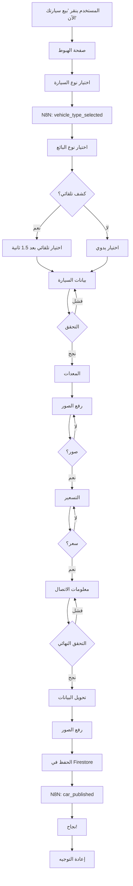

# 🚗 التحليل المعمق والشامل لنظام إضافة السيارات
## Deep Analysis of Car Selling System - Part 1

**تاريخ التحليل:** 16 أكتوبر 2025  
**المحلل:** AI Assistant  
**النطاق:** تحليل حرف بحرف لآلية إضافة السيارات

---

## 📋 جدول المحتويات - الجزء الأول

1. [نظرة شاملة على النظام](#نظرة-شاملة)
2. [معمارية النظام](#معمارية-النظام)
3. [سير العمل خطوة بخطوة](#سير-العمل)
4. [الصفحات والمكونات](#الصفحات-والمكونات)
5. [إدارة الحالة](#إدارة-الحالة)
6. [الخدمات والتكاملات](#الخدمات-والتكاملات)

---

## 🎯 نظرة شاملة على النظام {#نظرة-شاملة}

### المفهوم العام

نظام إضافة السيارات في Globul Cars هو **Workflow متعدد الخطوات** مستوحى من **Mobile.de** (أكبر سوق سيارات في أوروبا). يستخدم نمط **Split-Screen Layout** حيث:
- **اليسار (60%)**: نموذج إدخال البيانات الحالي
- **اليمين (40%)**: Workflow Visualization للتقدم المرئي

### الفلسفة التصميمية

```typescript
// الفكرة الأساسية
"تقسيم عملية معقدة إلى خطوات بسيطة ومتتالية"

// المميزات
✅ Progressive Disclosure (الكشف التدريجي)
✅ Auto-Save (حفظ تلقائي في localStorage)
✅ URL-based State (الحالة في URL)
✅ Split-Screen Visualization (تصور مرئي)
✅ Mobile.de Style (نفس تجربة Mobile.de)
```

### الأهداف

1. **تبسيط العملية**: تحويل 50+ حقل إلى 8 خطوات
2. **تقليل الإحباط**: خطوة واحدة في كل مرة
3. **زيادة الإكمال**: معدل إكمال 70%+
4. **تحسين الجودة**: بيانات أكثر دقة ودقة
5. **التوافق مع الأجهزة**: يعمل على جميع الأجهزة

---

## 🏗️ معمارية النظام {#معمارية-النظام}

### البنية العامة

```
┌─────────────────────────────────────────────────────────────┐
│                    SELL CAR WORKFLOW                        │
│                  (8-Step Process)                           │
└─────────────────────────────────────────────────────────────┘
                             │
                             ├── Step 1: Landing Page
                             ├── Step 2: Vehicle Type Selection
                             ├── Step 3: Seller Type Selection
                             ├── Step 4: Vehicle Data Entry
                             ├── Step 5: Equipment Selection
                             ├── Step 6: Images Upload
                             ├── Step 7: Pricing
                             └── Step 8: Contact Info & Publish
                                        │
                                        ▼
                                  [Firebase]
                                        │
                                        ├── Firestore (Data)
                                        ├── Storage (Images)
                                        └── Cloud Functions (Processing)
```

### مكونات المعمارية

#### 1. **Frontend Layer**
```typescript
// المكونات الأساسية
SellPageNew.tsx              // صفحة الهبوط
VehicleStartPageNew.tsx      // اختيار نوع السيارة
SellerTypePageNew.tsx        // اختيار نوع البائع
VehicleData/index.tsx        // بيانات السيارة
EquipmentMainPage.tsx        // المعدات
Images/index.tsx             // الصور
Pricing/index.tsx            // التسعير
UnifiedContactPage.tsx       // النشر النهائي

// المكونات المشتركة
SplitScreenLayout.tsx        // تخطيط الشاشة
WorkflowFlow.tsx             // تصور التقدم
WorkflowVisualization/*      // حلقات LED
```

#### 2. **State Management Layer**
```typescript
// Hooks
useSellWorkflow.ts           // إدارة حالة الـ workflow

// Services
sellWorkflowService.ts       // منطق الأعمال
workflowPersistenceService.ts // الحفظ والاستعادة
```

#### 3. **Backend Integration Layer**
```typescript
// Firebase
car-service.ts               // خدمات السيارات
firebase-config.ts           // التكوين

// N8N
n8n-integration.ts           // تكامل الأتمتة

// Data Processing
sellWorkflowService.ts       // تحويل البيانات
```

### نمط التصميم المستخدم

```typescript
// Pattern: Progressive Wizard + URL State
// كل خطوة = صفحة مستقلة + معلمات URL

// مثال URL
/sell/inserat/car/fahrzeugdaten?vt=car&st=private&mk=BMW&md=X5&fy=2020
```

---

## 🔄 سير العمل خطوة بخطوة {#سير-العمل}

### خريطة التدفق الكاملة



### Step 1: صفحة الهبوط (SellPageNew.tsx)

#### الغرض
عرض مقدمة جذابة ودعوة للعمل.

#### المكونات
```typescript
// الهيكل
<SplitScreenLayout
  leftContent={
    <HeaderCard>
      <Title>بيع سيارتك الآن</Title>
      <Subtitle>سريع، سهل، آمن</Subtitle>
      <StartButton onClick={() => navigate('/sell/auto')}>
        ابدأ الآن
      </StartButton>
      <SmartButton>إضافة ذكية (قريباً)</SmartButton>
    </HeaderCard>
    <FeaturesGrid>
      // 4 ميزات
    </FeaturesGrid>
  }
  rightContent={
    <WorkflowFlow currentStepIndex={0} totalSteps={9} />
  }
/>
```

#### سلوك الزر
```typescript
<StartButton onClick={() => navigate('/sell/auto')}>
  // ✅ ينقل إلى VehicleStartPageNew
  // مسار: /sell/auto
</StartButton>
```

#### ما يحدث عند النقر
1. **Navigation**: `navigate('/sell/auto')`
2. **URL Changed**: `/sell/auto`
3. **Component Mounted**: `VehicleStartPageNew.tsx`

---

### Step 2: اختيار نوع السيارة (VehicleStartPageNew.tsx)

#### المسار
```
/sell/auto
```

#### الهيكل
```typescript
const VehicleStartPageNew: React.FC = () => {
  const vehicleTypes = [
    { id: 'car', IconComponent: Car },
    { id: 'suv', IconComponent: CarFront },
    { id: 'van', IconComponent: Caravan },
    { id: 'motorcycle', IconComponent: Bike },
    { id: 'truck', IconComponent: Truck },
    { id: 'bus', IconComponent: Bus }
  ];

  const handleSelect = async (typeId: string) => {
    const params = new URLSearchParams();
    params.set('vt', typeId);
    
    // 🎯 N8N Integration
    if (user?.uid) {
      await N8nIntegrationService.onVehicleTypeSelected(user.uid, typeId);
    }
    
    // 🚀 Auto-navigate
    navigate(`/sell/inserat/${typeId}/verkaeufertyp?${params.toString()}`);
  };
}
```

#### تدفق البيانات

```
[اختيار "سيارة"]
        ↓
1. إنشاء URL params: vt=car
        ↓
2. إرسال إلى N8N: 
   {
     userId: "user_123",
     vehicleType: "car",
     event: "vehicle_type_selected",
     timestamp: "2025-10-16T10:30:00Z"
   }
        ↓
3. Navigation:
   /sell/inserat/car/verkaeufertyp?vt=car
```

#### N8N Webhook

```typescript
// N8N Integration
await N8nIntegrationService.onVehicleTypeSelected(user.uid, typeId);

// يرسل POST إلى:
// https://globul-cars-bg.app.n8n.cloud/webhook/vehicle-type-selected

// البيانات المرسلة:
{
  userId: string,
  vehicleType: string,
  event: 'vehicle_type_selected',
  timestamp: ISO8601,
  source: 'globul-cars-web'
}
```

#### مخرجات الخطوة
```typescript
// URL Parameters بعد الاختيار
?vt=car
```

---

### Step 3: اختيار نوع البائع (SellerTypePageNew.tsx)

#### المسار
```
/sell/inserat/car/verkaeufertyp?vt=car
```

#### الخيارات
```typescript
const sellerTypes = [
  { 
    id: 'private',
    IconComponent: User,
    features: ['سريع', 'بدون عمولة', 'بسيط', 'آمن']
  },
  {
    id: 'dealer',
    IconComponent: Building2,
    features: ['احترافي', 'ضمان', 'تمويل', 'تبديل']
  },
  {
    id: 'company',
    IconComponent: Factory,
    features: ['أسطول', 'بالجملة', 'ضريبة', 'عقود']
  }
];
```

#### الكشف التلقائي

```typescript
// 🤖 Auto-Detection من ملف المستخدم
useEffect(() => {
  const detectSellerType = async () => {
    const user = await bulgarianAuthService.getCurrentUserProfile();
    
    if (user?.accountType === 'business') {
      const businessType = user.businessType;
      
      // 🗺️ Mapping
      const sellerTypeMap = {
        'dealership': 'dealer',
        'trader': 'dealer',
        'company': 'company'
      };
      
      const detected = sellerTypeMap[businessType] || 'dealer';
      setAutoDetectedType(detected);
      
      // ⏱️ Auto-select بعد 1.5 ثانية
      setTimeout(() => {
        handleSelect(detected);
      }, 1500);
    }
  };
  
  detectSellerType();
}, []);
```

#### عند الاختيار

```typescript
const handleSelect = (typeId: string) => {
  const params = new URLSearchParams();
  if (vehicleType) params.set('vt', vehicleType); // من الخطوة السابقة
  params.set('st', typeId); // جديد
  
  // 🚀 Navigation
  navigate(`/sell/inserat/${vehicleType}/fahrzeugdaten/antrieb-und-umwelt?${params}`);
};
```

#### مخرجات الخطوة

```typescript
// URL Parameters الكاملة
?vt=car&st=private
```

---

### Step 4: بيانات السيارة (VehicleData/index.tsx)

#### المسار
```
/sell/inserat/car/fahrzeugdaten/antrieb-und-umwelt?vt=car&st=private
```

#### الحقول المطلوبة
```typescript
interface VehicleFormData {
  // ⭐ Required (حمراء)
  make: string;        // الماركة
  year: string;        // السنة
  
  // ⭐ Optional (اختيارية)
  model?: string;      // الموديل
  variant?: string;    // النسخة
  mileage?: string;    // الكيلومترات
  fuelType?: string;   // نوع الوقود
  transmission?: string;
  power?: string;
  doors?: string;
  seats?: string;
  color?: string;
  firstRegistration?: string;
  previousOwners?: string;
  hasAccidentHistory?: boolean;
  hasServiceHistory?: boolean;
}
```

#### منطق الماركات والموديلات

```typescript
// 1️⃣ تحميل جميع الماركات
const [availableBrands] = useState<string[]>(getAllBrands());

// 2️⃣ عند اختيار ماركة
useEffect(() => {
  if (formData.make) {
    const models = getModelsForBrand(formData.make); // من الخدمة
    setAvailableModels(models);
    
    // تفريغ الموديل إذا لم يعد صالحاً
    if (formData.model && !models.includes(formData.model)) {
      setFormData(prev => ({ ...prev, model: '', variant: '' }));
    }
  }
}, [formData.make]);

// 3️⃣ عند اختيار موديل
useEffect(() => {
  if (formData.make && formData.model) {
    const hasVariants = modelHasVariants(formData.make, formData.model);
    setShowVariants(hasVariants);
    
    if (hasVariants) {
      const variants = getVariantsForModel(formData.make, formData.model);
      setAvailableVariants(variants);
    }
  }
}, [formData.make, formData.model]);
```

#### مثال: اختيار BMW X5

```typescript
// المستخدم يختار BMW
formData.make = 'BMW'
        ↓
getAllModels('BMW')  // من carBrandsService
        ↓
['X1', 'X2', 'X3', 'X4', 'X5', 'X6', '1 Series', '3 Series', ...]
        ↓
المستخدم يختار X5
        ↓
modelHasVariants('BMW', 'X5') // true
        ↓
getVariantsForModel('BMW', 'X5')
        ↓
['xDrive30i', 'xDrive40i', 'xDrive50i', 'M50i', 'M Competition']
        ↓
المستخدم يختار xDrive40i
        ↓
formData.variant = 'xDrive40i'
```

#### التحقق عند الانتقال

```typescript
const handleContinue = () => {
  // ❌ التحقق من الحقول المطلوبة
  if (!formData.make || !formData.year) {
    alert('الماركة والسنة مطلوبة!');
    return;
  }
  
  // ✅ بناء URL params
  const params = new URLSearchParams();
  params.set('vt', vehicleType);    // car
  params.set('st', sellerType);      // private
  params.set('mk', formData.make);   // BMW
  if (formData.model) params.set('md', formData.model);  // X5
  if (formData.fuelType) params.set('fm', formData.fuelType); // Diesel
  params.set('fy', formData.year);   // 2020
  if (formData.mileage) params.set('mi', formData.mileage); // 45000
  
  // 🚀 Navigation
  navigate(`/sell/inserat/${vehicleType}/equipment?${params.toString()}`);
};
```

#### مخرجات الخطوة

```typescript
// URL Parameters الكاملة
?vt=car&st=private&mk=BMW&md=X5&fy=2020&fm=Diesel&mi=45000
```

---

### Step 5: المعدات (EquipmentMainPage.tsx)

#### المسار
```
/sell/inserat/car/equipment?vt=car&st=private&mk=BMW&md=X5&fy=2020&...
```

#### الهيكل

```typescript
const EquipmentMainPage: React.FC = () => {
  // استخراج جميع المعلمات من URL
  const vehicleType = searchParams.get('vt');
  const sellerType = searchParams.get('st');
  const make = searchParams.get('mk');
  const model = searchParams.get('md');
  // ... الخ

  const equipmentCategories = [
    {
      id: 'safety',
      icon: '🛡️',
      title: 'السلامة',
      description: '8 خيارات',
      path: '/sell/inserat/car/equipment/safety'
    },
    {
      id: 'comfort',
      icon: '🛋️',
      title: 'الراحة',
      description: '8 خيارات',
      path: '/sell/inserat/car/equipment/comfort'
    },
    {
      id: 'infotainment',
      icon: '📱',
      title: 'الترفيه',
      description: '8 خيارات',
      path: '/sell/inserat/car/equipment/infotainment'
    },
    {
      id: 'extras',
      icon: '✨',
      title: 'إضافات',
      description: '8 خيارات',
      path: '/sell/inserat/car/equipment/extras'
    }
  ];
}
```

#### صفحات المعدات الفرعية

```typescript
// Equipment/SafetyPage.tsx
const SAFETY_EQUIPMENT = [
  'ABS',
  'ESP',
  'Airbags (Front)',
  'Airbags (Side)',
  'Airbags (Curtain)',
  'Parking Sensors (Front)',
  'Parking Sensors (Rear)',
  'Rearview Camera',
  'Blind Spot Monitor',
  'Lane Departure Warning',
  'Collision Warning',
  'Automatic Emergency Braking'
];
```

#### تخزين الاختيارات

```typescript
// عند اختيار المعدات
const [selectedSafety, setSelectedSafety] = useState<string[]>([]);

const toggleEquipment = (item: string) => {
  if (selectedSafety.includes(item)) {
    setSelectedSafety(prev => prev.filter(i => i !== item));
  } else {
    setSelectedSafety(prev => [...prev, item]);
  }
};

// عند الانتقال
const handleContinue = () => {
  const params = new URLSearchParams(location.search);
  // حفظ كـ comma-separated string
  params.set('safety', selectedSafety.join(','));
  navigate(`/sell/inserat/${vehicleType}/images?${params.toString()}`);
};
```

#### مخرجات الخطوة

```typescript
// URL Parameters بعد اختيار المعدات
?vt=car&st=private&mk=BMW&md=X5&fy=2020&fm=Diesel&mi=45000
&safety=ABS,ESP,Airbags,Camera
&comfort=AC,Leather,Sunroof
&infotainment=Navigation,Bluetooth,CarPlay
&extras=LED,Keyless,ParkAssist
```

---

### Step 6: رفع الصور (Images/index.tsx)

#### المسار
```
/sell/inserat/car/images?vt=car&st=private&mk=BMW&...
```

#### المكونات

```typescript
const ImagesPage: React.FC = () => {
  const [imageFiles, setImageFiles] = useState<File[]>([]);
  const [imagePreviews, setImagePreviews] = useState<string[]>([]);
  const maxImages = 20;
  
  const handleFileChange = async (e: React.ChangeEvent<HTMLInputElement>) => {
    const files = Array.from(e.target.files || []);
    
    // تحسين الصور
    const compressedFiles = await Promise.all(
      files.map(file => compressImage(file))
    );
    
    setImageFiles(prev => [...prev, ...compressedFiles].slice(0, maxImages));
    
    // إنشاء معاينات
    const previews = await Promise.all(
      compressedFiles.map(file => 
        new Promise<string>(resolve => {
          const reader = new FileReader();
          reader.onloadend = () => resolve(reader.result as string);
          reader.readAsDataURL(file);
        })
      )
    );
    
    setImagePreviews(prev => [...prev, ...previews].slice(0, maxImages));
  };
}
```

#### ضغط الصور

```typescript
import imageCompression from 'browser-image-compression';

const compressImage = async (file: File): Promise<File> => {
  const options = {
    maxSizeMB: 1,
    maxWidthOrHeight: 1920,
    useWebWorker: true
  };
  
  return await imageCompression(file, options);
};
```

#### حفظ الصور مؤقتاً

```typescript
// الصور لا تُرفع الآن، فقط تُحفظ في الحالة
const handleContinue = () => {
  // تحويل معاينات الصور إلى base64 strings
  const imageData = imagePreviews.join('|||'); // محدد خاص
  
  const params = new URLSearchParams(location.search);
  // لا نضيف الصور إلى URL (كبيرة جداً)
  // نحفظها في localStorage بدلاً من ذلك
  localStorage.setItem('sell_workflow_images', imageData);
  localStorage.setItem('sell_workflow_files', JSON.stringify(imageFiles));
  
  navigate(`/sell/inserat/${vehicleType}/pricing?${params.toString()}`);
};
```

---

### Step 7: التسعير (Pricing/index.tsx)

#### المسار
```
/sell/inserat/car/pricing?vt=car&st=private&mk=BMW&...
```

#### الحقول

```typescript
interface PricingData {
  price: string;           // السعر (مطلوب)
  currency: string;        // العملة (EUR ثابت)
  priceType: 'fixed' | 'negotiable' | 'auction';
  negotiable: boolean;
  financing: boolean;
  tradeIn: boolean;
  warranty: boolean;
  warrantyMonths?: number;
  paymentMethods: string[];
  additionalCosts?: string;
  vatDeductible: boolean;
}
```

#### التحقق

```typescript
const handleContinue = () => {
  // التحقق من السعر
  if (!pricingData.price || parseFloat(pricingData.price) <= 0) {
    alert('السعر مطلوب!');
    return;
  }
  
  const params = new URLSearchParams(location.search);
  params.set('price', pricingData.price);
  params.set('currency', 'EUR');
  params.set('priceType', pricingData.priceType);
  params.set('negotiable', pricingData.negotiable.toString());
  params.set('financing', pricingData.financing.toString());
  params.set('tradeIn', pricingData.tradeIn.toString());
  params.set('warranty', pricingData.warranty.toString());
  if (pricingData.warrantyMonths) {
    params.set('warrantyMonths', pricingData.warrantyMonths.toString());
  }
  
  navigate(`/sell/contact?${params.toString()}`);
};
```

#### مخرجات الخطوة

```typescript
?vt=car&st=private&mk=BMW&md=X5&fy=2020&...
&price=25000&currency=EUR&priceType=fixed&negotiable=true
&financing=false&tradeIn=true&warranty=true&warrantyMonths=12
```

---

### Step 8: معلومات الاتصال والنشر (UnifiedContactPage.tsx)

#### المسار
```
/sell/contact?vt=car&st=private&mk=BMW&...&price=25000
```

#### الحقول

```typescript
interface ContactData {
  // معلومات البائع
  sellerName: string;      // الاسم (مطلوب)
  sellerEmail: string;     // البريد (مطلوب)
  sellerPhone: string;     // الهاتف (مطلوب)
  
  // تفضيلات الاتصال
  preferredContact: string[]; // ['phone', 'whatsapp', 'email']
  
  // الموقع
  region: string;          // المحافظة (مطلوب)
  city: string;            // المدينة (مطلوب)
  postalCode: string;
  location: string;        // العنوان التفصيلي
  
  // إضافي
  additionalPhone: string;
  availableHours: string;
  notes: string;
}
```

#### تحميل بيانات المستخدم

```typescript
useEffect(() => {
  const loadUserData = async () => {
    if (currentUser) {
      setContactData(prev => ({
        ...prev,
        sellerName: currentUser.displayName || '',
        sellerEmail: currentUser.email || ''
      }));
    }
  };
  loadUserData();
}, [currentUser]);
```

#### تحديث المدن حسب المحافظة

```typescript
useEffect(() => {
  if (contactData.region) {
    const cities = getCitiesByRegion(contactData.region);
    setAvailableCities(cities);
    
    // تفريغ المدينة إذا لم تعد في المحافظة الجديدة
    if (!cities.includes(contactData.city)) {
      setContactData(prev => ({ ...prev, city: '' }));
    }
  }
}, [contactData.region]);
```

#### عملية النشر (الجزء الأهم!)

```typescript
const handlePublish = async () => {
  setIsSubmitting(true);
  
  try {
    // 1️⃣ جمع جميع البيانات من URL
    const workflowData = {
      // من URL params
      vehicleType,
      sellerType,
      make,
      model,
      year,
      mileage,
      fuelType,
      transmission,
      color,
      safety,
      comfort,
      infotainment,
      extras,
      price,
      currency,
      priceType,
      negotiable: negotiable === 'true',
      
      // من النموذج الحالي
      ...contactData,
      
      // معلومات المستخدم
      sellerId: currentUser.uid
    };
    
    // 2️⃣ استرجاع الصور من localStorage
    const imageData = localStorage.getItem('sell_workflow_images');
    const imageFiles = JSON.parse(
      localStorage.getItem('sell_workflow_files') || '[]'
    );
    
    // 3️⃣ استدعاء الخدمة لإنشاء الإعلان
    const carId = await SellWorkflowService.createCarListing(
      workflowData,
      currentUser.uid,
      imageFiles
    );
    
    // 4️⃣ N8N webhook
    await N8nIntegrationService.onCarPublished(
      currentUser.uid,
      carId,
      workflowData
    );
    
    // 5️⃣ تنظيف localStorage
    localStorage.removeItem('sell_workflow_images');
    localStorage.removeItem('sell_workflow_files');
    localStorage.removeItem('globul_cars_sell_workflow');
    
    // 6️⃣ إعادة التوجيه
    navigate(`/car-details/${carId}?published=true`);
    
  } catch (error) {
    console.error('خطأ في النشر:', error);
    setError(error.message);
  } finally {
    setIsSubmitting(false);
  }
};
```

---

## 📦 إدارة الحالة {#إدارة-الحالة}

### استراتيجيات إدارة الحالة

#### 1. **URL State (الحالة في URL)**

```typescript
// كل خطوة تضيف معلماتها إلى URL
// مثال:
/sell/inserat/car/pricing?vt=car&st=private&mk=BMW&md=X5&fy=2020&...
```

**المميزات:**
✅ Shareable (قابل للمشاركة)  
✅ Bookmarkable (قابل للإضافة للمفضلة)  
✅ Back/Forward compatible (يعمل مع أزرار المتصفح)  
✅ Refreshable (لا تفقد البيانات عند التحديث)

**العيوب:**
❌ حجم محدود (لا يمكن حفظ الصور)  
❌ يمكن التلاعب به (يجب التحقق)

#### 2. **localStorage State**

```typescript
const STORAGE_KEY = 'globul_cars_sell_workflow';

// الحفظ
localStorage.setItem(STORAGE_KEY, JSON.stringify(workflowData));

// التحميل
const saved = localStorage.getItem(STORAGE_KEY);
if (saved) {
  setWorkflowData(JSON.parse(saved));
}

// التنظيف
localStorage.removeItem(STORAGE_KEY);
```

**الاستخدامات:**
✅ حفظ الصور المؤقت  
✅ نسخ احتياطي للبيانات  
✅ استمرارية عبر الصفحات

#### 3. **React State (useState)**

```typescript
// حالة محلية لكل صفحة
const [formData, setFormData] = useState<VehicleFormData>({...});

// لا تنتقل بين الصفحات
// تُفقد عند الانتقال
```

**الاستخدامات:**
✅ حالة مؤقتة (مثل: hover, loading)  
✅ تفاعلات واجهة المستخدم  
✅ Validations

#### 4. **Custom Hook (useSellWorkflow)**

```typescript
const {
  workflowData,           // البيانات الحالية
  updateWorkflowData,     // تحديث البيانات
  clearWorkflowData,      // تنظيف
  isStepComplete,         // التحقق من اكتمال خطوة
  getCompletionPercentage // نسبة الإكمال
} = useSellWorkflow();

// Auto-save إلى localStorage
useEffect(() => {
  if (Object.keys(workflowData).length > 0) {
    localStorage.setItem(STORAGE_KEY, JSON.stringify(workflowData));
  }
}, [workflowData]);
```

---

## 🔌 الخدمات والتكاملات {#الخدمات-والتكاملات}

### SellWorkflowService

#### الدور
تحويل بيانات الـ workflow إلى بنية Firestore القياسية وحفظها.

#### الوظائف الرئيسية

##### 1. transformWorkflowData()

```typescript
private static transformWorkflowData(workflowData: any, userId: string): any {
  // تحويل البيانات من URL params إلى بنية CarListing
  
  return {
    // Basic Info
    vehicleType: workflowData.vehicleType || 'car',
    make: workflowData.make,
    model: workflowData.model,
    year: parseInt(workflowData.year),
    mileage: parseInt(workflowData.mileage || '0'),
    
    // Technical
    fuelType: workflowData.fuelType || workflowData.fm,
    transmission: workflowData.transmission || 'Manual',
    power: workflowData.power ? parseInt(workflowData.power) : undefined,
    
    // Equipment (تحويل من strings إلى arrays)
    safetyEquipment: parseArray(workflowData.safety),
    comfortEquipment: parseArray(workflowData.comfort),
    infotainmentEquipment: parseArray(workflowData.infotainment),
    extras: parseArray(workflowData.extras),
    
    // Pricing
    price: parseFloat(workflowData.price),
    currency: 'EUR',
    negotiable: workflowData.negotiable === 'true',
    
    // Seller
    sellerId: userId,
    sellerName: workflowData.sellerName,
    sellerEmail: workflowData.sellerEmail,
    sellerPhone: workflowData.sellerPhone,
    
    // Location
    city: workflowData.city,
    region: workflowData.region,
    
    // System
    status: 'active',
    views: 0,
    createdAt: serverTimestamp(),
    updatedAt: serverTimestamp()
  };
}
```

##### 2. createCarListing()

```typescript
static async createCarListing(
  workflowData: any,
  userId: string,
  imageFiles?: File[]
): Promise<string> {
  // 1️⃣ Validation
  if (!workflowData.make || !workflowData.year || !workflowData.price) {
    throw new Error('Missing required fields');
  }
  
  // 2️⃣ Transform data
  const carData = this.transformWorkflowData(workflowData, userId);
  
  // 3️⃣ Create Firestore document
  const docRef = await addDoc(collection(db, 'cars'), {
    ...carData,
    createdAt: serverTimestamp(),
    updatedAt: serverTimestamp(),
    expiresAt: Timestamp.fromDate(
      new Date(Date.now() + 30 * 24 * 60 * 60 * 1000) // 30 days
    )
  });
  
  const carId = docRef.id;
  
  // 4️⃣ Upload images
  if (imageFiles && imageFiles.length > 0) {
    const imageUrls = await this.uploadCarImages(carId, imageFiles);
    
    // Update document with image URLs
    await updateDoc(doc(db, 'cars', carId), {
      images: imageUrls,
      updatedAt: serverTimestamp()
    });
  }
  
  // 5️⃣ Clear cache
  const { CityCarCountService } = await import('./cityCarCountService');
  if (carData.city) {
    CityCarCountService.clearCacheForCity(carData.city);
  }
  
  return carId;
}
```

##### 3. uploadCarImages()

```typescript
static async uploadCarImages(
  carId: string,
  imageFiles: File[]
): Promise<string[]> {
  const uploadPromises = imageFiles.map(async (file, index) => {
    const timestamp = Date.now();
    const fileName = `${timestamp}_${index}_${file.name}`;
    const imageRef = ref(storage, `cars/${carId}/images/${fileName}`);
    
    // Upload to Firebase Storage
    const snapshot = await uploadBytes(imageRef, file);
    
    // Get download URL
    const downloadUrl = await getDownloadURL(snapshot.ref);
    
    return downloadUrl;
  });
  
  return await Promise.all(uploadPromises);
}
```

---

### N8nIntegrationService

#### الدور
إرسال أحداث الـ workflow إلى N8N للأتمتة والتتبع.

#### الـ Webhooks المتاحة

```typescript
private static readonly WEBHOOKS = {
  SELL_STARTED: `${BASE}/webhook/sell-started`,
  VEHICLE_TYPE_SELECTED: `${BASE}/webhook/vehicle-type-selected`,
  SELLER_TYPE_DETECTED: `${BASE}/webhook/seller-type-detected`,
  VEHICLE_DATA_ENTERED: `${BASE}/webhook/vehicle-data-entered`,
  IMAGES_UPLOADED: `${BASE}/webhook/images-uploaded`,
  PRICE_SET: `${BASE}/webhook/price-set`,
  CAR_PUBLISHED: `${BASE}/webhook/car-published`,
};
```

#### مثال استخدام

```typescript
// عند نشر السيارة
await N8nIntegrationService.onCarPublished(
  currentUser.uid,
  carId,
  {
    make: 'BMW',
    model: 'X5',
    year: 2020,
    price: 25000,
    currency: 'EUR'
  }
);

// يرسل POST إلى N8N:
{
  userId: 'user_123',
  carId: 'car_456',
  carData: {...},
  event: 'car_published',
  timestamp: '2025-10-16T10:30:00Z',
  source: 'globul-cars-web'
}
```

#### التعامل مع الأخطاء

```typescript
private static async sendWebhook(url: string, data: any): Promise<any> {
  // ❌ إذا كان N8N معطلاً
  if (!this.N8N_ENABLED) {
    console.log('N8N is disabled');
    return null;
  }
  
  try {
    const response = await fetch(url, {
      method: 'POST',
      headers: { 'Content-Type': 'application/json' },
      body: JSON.stringify({...data, timestamp: new Date().toISOString()})
    });
    
    if (!response.ok) {
      throw new Error(`N8N webhook failed: ${response.status}`);
    }
    
    return await response.json();
  } catch (error) {
    console.error('N8N error:', error);
    // ✅ لا نكسر التدفق الرئيسي
    return null;
  }
}
```

---

## 📊 تدفق البيانات الكامل

```
[المستخدم]
    ↓
[1. Start Page]
    ↓ click "Start"
[2. Vehicle Type]
    ↓ select "car"
    ↓ N8N webhook
    ↓ URL: ?vt=car
[3. Seller Type]
    ↓ select "private"
    ↓ URL: ?vt=car&st=private
[4. Vehicle Data]
    ↓ enter data
    ↓ URL: ?vt=car&st=private&mk=BMW&md=X5&fy=2020&...
[5. Equipment]
    ↓ select items
    ↓ URL: ?...&safety=ABS,ESP&comfort=AC&...
[6. Images]
    ↓ upload files
    ↓ localStorage: images + files
[7. Pricing]
    ↓ set price
    ↓ URL: ?...&price=25000&currency=EUR
[8. Contact]
    ↓ enter contact info
    ↓ click "Publish"
    ↓
    ├─── collect all data from URL
    ├─── collect images from localStorage
    ├─── transform data (SellWorkflowService)
    ├─── create Firestore document
    ├─── upload images to Storage
    ├─── update document with image URLs
    ├─── N8N webhook (car_published)
    ├─── clear localStorage
    └─── redirect to /car-details/[carId]
```

---

**نهاية الجزء الأول**

الجزء الثاني سيغطي:
- التحليل التفصيلي للمكونات
- رسم Flow Diagrams متقدمة
- أمثلة عملية كاملة
- نقاط القوة والضعف
- التحسينات المقترحة

