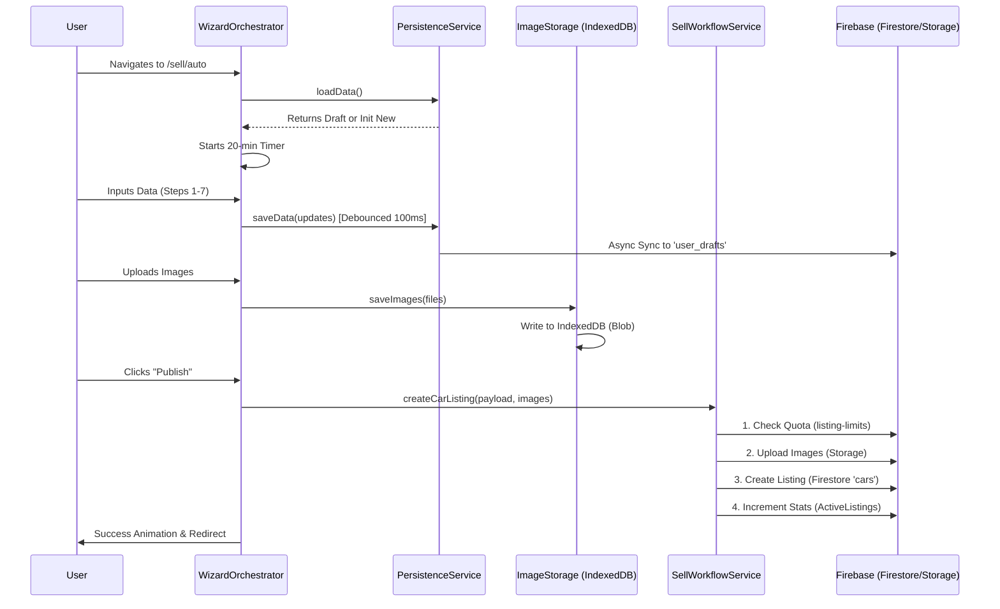

# 🏁 THE HOLY GRAIL: Car Selling Architecture & Implementation
## Comprehensive, Strict, and Binding Technical Documentation

**Version:** 2.1 (Final Architecture + Constitutional Routing)
**Scope:** New Globul Cars - Car Selling Feature (Add Car/Add Ad)
**Status:** **Binding Source of Truth**

This document serves as the absolute technical reference for the Car Selling feature. It exhaustively details the architecture, service layer, frontend workflows, security enforcements, and project standards.

---

## 📌 Table of Contents

1.  [Architectural Environment](#1-architectural-environment)
2.  [Service Layer Deep Dive](#2-service-layer-deep-dive)
3.  [Frontend Implementation & Workflow](#3-frontend-implementation--workflow)
4.  [Smart Systems (AI & Classification)](#4-smart-systems-ai--classification)
5.  [Security, Routing & Compliance](#5-security-routing--compliance)
6.  [Performance & Error Handling](#6-performance--error-handling)
7.  [Project Constitution & Development Standards](#7-project-constitution--development-standards)
8.  [Code Structure Map](#8-code-structure-map)
9.  [Appendix A: The Constitutional Routing System](#9-appendix-a-the-constitutional-routing-system)

---

## 1. Architectural Environment

The feature relies on a **Resilient Distributed State Architecture**, designed to robustly handle complex forms, large media assets, and cross-device synchronization without data loss.

### 🏛️ Core Pillars
1.  **Orchestrated Wizard Pattern**: A central `WizardOrchestrator` manages step logic, ensuring separation of concerns between UI presentation and state management.
2.  **Hybrid Persistence Layer**:
    *   **Local Persistence**: `localStorage` (via `UnifiedWorkflowPersistenceService`) for immediate crash recovery.
    *   **Binary Persistence**: **IndexedDB** (via `ImageStorageService`) stores high-res images locally, bypassing browser storage limits.
    *   **Cloud Persistence**: **Firestore** (`user_drafts` collection) synchronizes draft state across devices.
3.  **Strict 20-Minute Epoch**: A hard-coded timer (`TIMER_DURATION`) enforces a 20-minute completion window. Upon expiry, a `executeFullReset()` command wipes all local and cloud data to prevent stale state.

### 🔄 Data Lifecycle Diagram


---

## 2. Service Layer Deep Dive

The backend logic is decoupled into specialized execution units.

### 🛡️ `SellWorkflowService` (Publisher)
The primary execution engine for the "Publish" action.
*   **Quota Check**: Consults `listing-limits.ts` to verify user subscription limits (Private: 3, Dealer: 50, Company: ∞).
*   **Image Pipeline**: Orchestrates multi-threaded uploads via `SellWorkflowImages`, returning public URLs.
*   **Unification**: Merges form data, image URLs, and system metadata (`createdAt`, `status: active`).
*   **Transaction**: Performs the final database write via `unifiedCarService.createCar` and increments user stats.

### 💾 `UnifiedWorkflowPersistenceService` (Draft Manager)
Manages the "Save as you type" functionality.
*   **Debounced Writes**: Saves to `localStorage` every 100ms to prevent UI blocking.
*   **Cloud Sync**: Silently pushes `UnifiedWorkflowData` to `user_drafts/{uid}` for authenticated users.
*   **Auto-Cleanup**: Automatically cleans up artifacts if the 20-minute timer expires.

### 🔢 `NumericIdAssignmentService` (Identity)
Ensures SEO-friendly, readable URLs by converting cryptographic UIDs to incremental integers.
*   **Mechanism**: Transactional update of a `counters/userIds` document.
*   **Output**: Converts `7f8a9...` → User `#90`.
*   **Usage**: Used for Profile URLs (`/profile/90`) and Car URLs (`/car/90/5`).

### 📊 `ListingLimitsService` (Quotas)
Enforces subscription tiers strictly before publication.
*   **Private**: Max 3 active listings.
*   **Dealer**: Max 50 active listings.
*   **Company**: Unlimited.
*   **Enforcement**: Fails the promise chain in `createCarListing` if the limit is reached, triggering a UI Paywall Modal.

---

## 3. Frontend Implementation & Workflow

The UI is a Unified Modal Wizard located at `src/pages/04_car-selling/sell/`.

### 📍 Entry & Orchestration
*   **Entry Point**: `SellModalPage.tsx` initializes the context and checks URL parameters (`?vt=car`).
*   **Orchestrator**: `WizardOrchestrator.tsx` handles the "Prev/Next" logic, validations, and the final submission trigger.

### 🗺️ The 7-Step Workflow
1.  **Step 1: Category**: Selection of root vehicle type (Car, SUV, Bike, etc.).
2.  **Step 2: Technical Specs**: The core data form (Make, Model, Year, Engine). Includes **Smart Classification**.
3.  **Step 3: Equipment**: Multi-select arrays for Safety, Comfort, and Extras.
4.  **Step 4: Media**: Drag-and-drop gallery interfacing with IndexedDB. Supports drag-to-reorder.
5.  **Step 5: Pricing**: Currency (BGN/EUR/USD), Price negotiation toggle, VAT status.
6.  **Step 6.5: AI Assistant**: Generates descriptions (see Section 4).
7.  **Step 6: Final Review**: Contact details and final summary view.

---

## 4. Smart Systems (AI & Classification)

### 🤖 AI Description Generator (`SellVehicleStep6_5.tsx`)
Generates professional sales copy in Bulgarian/English.
*   **Input**: Brand, Model, Year, Fuel, HP, features list.
*   **Processing**: Sends a prompt to OpenAI API (or internal AI service).
*   **Constraints**:
    *   No emojis permitted (Strict Constitution Rule).
    *   Professional listing tone.
    *   Max 500 words.

### 🏷️ Smart Classification System (`SellVehicleStep2.tsx`)
Automatically assigns a visual category badge based on specs.
*   **Sport**: Horsepower > 250hp **OR** Doors ≤ 2.
*   **Family**: Doors ≥ 5 **AND** Horsepower ≤ 150hp.
*   **Standard**: All other configurations.
*   **Visuals**: Badges are persisted to `workflowData.badge` and displayed on the card.

---

## 5. Security, Routing & Compliance

###  Content Security Policy (CSP)
Configured in `firebase.json` to allow necessary services while blocking threats.
*   **Permitted Sources**:
    *   `https://storage.googleapis.com` (Service Workers, Images)
    *   `https://*.firebasedatabase.app` (Realtime Database)
    *   `https://www.gstatic.com` (Recaptcha)
*   **Blocked**: All unauthorized inline scripts and external frames.

### 📜 Firestore Security Rules
*   **Drafts**: `allow read, write: if request.auth.uid == userId` (Strict Ownership).
*   **Cars**:
    *   `allow read: if true` (Public).
    *   `allow create/update: if request.auth.uid == request.resource.data.sellerId` (Owner Only).

---

## 6. Performance & Error Handling

### ⚡ Optimization Strategies
1.  **Debouncing**: Save operations are debounced (100ms delay) to prevent `localStorage` thrashing during rapid typing.
2.  **Lazy Assets**: Images are generated as 200px thumbnails for UI flow; full-res blobs remain in IndexedDB until plain-time.
3.  **Memoization**: `useMemo` routes validation logic to avoid re-calculating on every render frame.

### ⚠️ Error Handling
*   **Upload Failures**: If Firebase Storage fails, the transaction aborts, and the user is notified. No partial "ghost" listings are created.
*   **Session Timeout**: At 20 minutes, `executeFullReset()` fires. A toast warns the user at the 15-minute mark.
*   **Limit Reached**: Pre-emptive check prevents the "Publish" button from processing if the user has hit their quota.

---

## 7. Project Constitution & Development Standards

### 📜 The "Constitution" (Strict Rules)
1.  **No Emojis**: Text descriptions and UI inputs must strictly exclude emojis (e.g., 🚗, ⭐).
2.  **Real Data**: All development must simulate real-world scenarios (Prices, Descriptions), no "test 123" data.
3.  **File Limits**: Source files must not exceed **300 lines**. Logic must be split into hooks or sub-components if it grows larger.
4.  **Deletion Policy**: Do not delete files directly. Move them to the `DDD` (Digital Debris Dump) folder for manual review.

### 🌍 Localization & Currency
*   **Primary Location**: Bulgaria (Republic of Bulgaria).
*   **Languages**: Bulgarian (BG) & English (EN).
*   **Currency**: Euro (€) / Lev (BGN).

---

## 8. Code Structure Map

Mandatory file ecosystem for the Car Selling feature.

```text
src/
├── components/SellWorkflow/
│   ├── steps/
│   │   ├── SellVehicleStep1.tsx        # Category Selector
│   │   ├── SellVehicleStep2.tsx        # Technical Specs & Smart Badge
│   │   ├── SellVehicleStep3.tsx        # Equipment Arrays
│   │   ├── SellVehicleStep4.tsx        # Image Gallery (IndexedDB)
│   │   ├── SellVehicleStep5.tsx        # Pricing & Finance
│   │   ├── SellVehicleStep6_5.tsx      # AI Description Generator
│   │   └── SellVehicleStep6.tsx        # Final Review
│   ├── hooks/
│   │   ├── useWizardState.ts           # State Management
│   │   ├── useWizardValidation.ts      # Validation Rules
│   │   └── useWizardTimer.ts           # 20-min Countdown
│   ├── WizardOrchestrator.tsx          # Master Controller
│   └── SellVehicleModal.tsx            # Context Root
├── services/
│   ├── sell-workflow-service.ts        # Publisher Service
│   ├── unified-workflow-persistence.service.ts # Persistence Engine
│   ├── ImageStorageService.ts          # IndexedDB Wrapper
│   ├── metric-id-assignment.service.ts # ID Generator
│   └── listing-limits.ts               # Quota System
└── routes/
    └── ProfilePageWrapper.tsx          # Enforces Constitutional Routing
```

---

## 9. Appendix A: The Constitutional Routing System

This section details the **strictly enforced** URL routing rules defined in the Project Constitution (`CONSTITUTION.md`). These rules are non-negotiable and are implemented in `ProfilePageWrapper.tsx`.

### 🛡️ Access Rules Matrix

| Actor | Action Target | Permitted URL | Forced Redirect To | Business Logic |
| :--- | :--- | :--- | :--- | :--- |
| **Logged In User (Owner)** | Own Profile | `/profile/:id` | **None** (Access Granted) | Owner sees private dashboard controls. |
| **Logged In User (Owner)** | Own Profile (View Mode) | `/profile/view/:id` | `/profile/:id` | Owner is forced to dashboard. |
| **Other User / Guest** | Another Profile | `/profile/view/:id` | **None** (Access Granted) | Public sees read-only view. |
| **Other User / Guest** | Another Profile (Private URL) | `/profile/:id` | `/profile/view/:id` | Unauthorized access redirected to public view. |

### 🔗 URL Pattern Dictionary

#### 1. User Profile (Private Dashboard)
*   **Pattern**: `/profile/:numericId`
*   **Example**: `http://localhost:3000/profile/90`
*   **Access**: **STRICTLY RESTRICTED** to the authenticated user whose `numericId` matches the URL parameter.

#### 2. User Profile (Public View)
*   **Pattern**: `/profile/view/:numericId`
*   **Example**: `http://localhost:3000/profile/view/80`
*   **Access**: Open to all users (Public).

#### 3. Vehicle Listing (Car Details)
*   **Pattern**: `/car/:sellerNumericId/:carNumericId`
*   **Example**: `http://localhost:3000/car/90/5`
*   **Logic**: Accessible to all. The URL structure `90/5` implies: "The 5th car posted by User #90".

#### 4. Edit Vehicle
*   **Pattern**: `/car/:sellerNumericId/:carNumericId/edit`
*   **Example**: `http://localhost:3000/car/90/5/edit`
*   **Access**: **STRICTLY RESTRICTED** to User #90 Only.

### 🧩 Implementation Hook Logic
The enforcement allows zero latency leaks by checking permissions immediately upon route mount:

```typescript
// Enforced in ProfilePageWrapper.tsx
useEffect(() => {
  const isOwner = currentUser.numericId === targetProfileId;
  const isViewMode = location.pathname.includes('/view/');

  if (isOwner && isViewMode) {
    // Owner trying to view public profile -> FORCE DASHBOARD
    navigate(`/profile/${targetProfileId}`, { replace: true });
  } 
  
  if (!isOwner && !isViewMode) {
    // Stranger trying to view private dashboard -> FORCE PUBLIC VIEW
    navigate(`/profile/view/${targetProfileId}`, { replace: true });
  }
}, [currentUser, targetProfileId, location]);
```