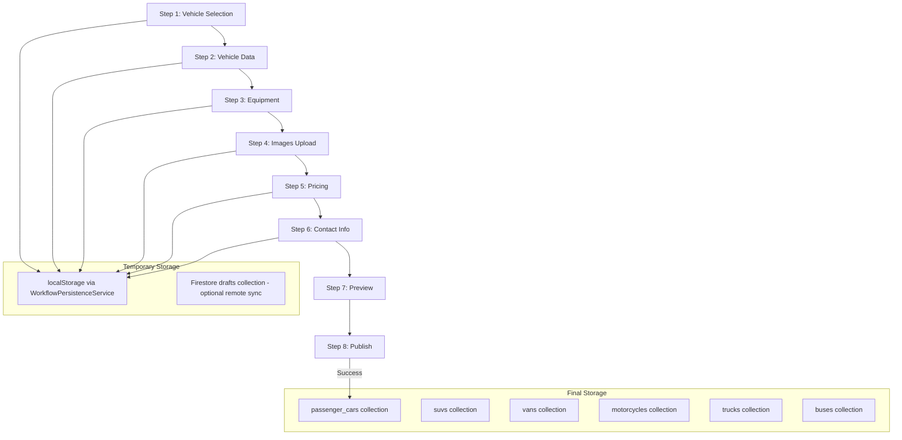

# 🔍 Koli One - Comprehensive System Analysis
## Deep Technical Audit & Development Roadmap

**Generated:** January 2026  
**Purpose:** Detailed analysis of all major systems for architecture review, optimization, and development planning  
**Target Audience:** Claude/Copilot in browser for task planning

---

## Table of Contents
1. [Services Folder Analysis](#1-services-folder-analysis)
2. [Sell Workflow Deep Dive](#2-sell-workflow-deep-dive)
3. [Firestore & Storage Rules Security Audit](#3-firestore--storage-rules-security-audit)
4. [Cloud Functions Inventory](#4-cloud-functions-inventory)
5. [Numeric ID System Analysis](#5-numeric-id-system-analysis)
6. [Messaging System Architecture](#6-messaging-system-architecture)
7. [Search System Analysis](#7-search-system-analysis)
8. [Admin Panel Security Review](#8-admin-panel-security-review)
9. [Mobile vs Web Parity Analysis](#9-mobile-vs-web-parity-analysis)
10. [Action Items & Recommendations](#10-action-items--recommendations)

---

## 1. Services Folder Analysis

### 📊 Directory Structure Overview

```
web/src/services/
├── admin/                  # 1 file: admin-verification.service.ts
├── ai/                     # AI integrations (Gemini, DeepSeek, OpenAI)
├── algolia/                # Algolia search client
├── analytics/              # Event tracking, BigQuery integration
├── auth/                   # Authentication helpers
├── billing/                # Subscription management
├── car/                    # 🔥 CORE: unified-car-*.ts (5+ files)
├── dealer/                 # Dealer-specific services
├── messaging/              # 📨 Real-time messaging (14+ files)
├── profile/                # User profiles, Bulgarian profiles
├── search/                 # 🔍 UnifiedSearchService (16+ files)
├── stories/                # Car Stories feature
├── trust/                  # Trust Score system
└── [100+ individual .ts files]
```

### 🔗 Dependency Graph (Critical Services)

```
┌─────────────────────────────────────────────────────────────────┐
│                      SellWorkflowService                        │
│  (Main Orchestrator for Car Listing Creation)                   │
└─────────────────────────┬───────────────────────────────────────┘
                          │
    ┌─────────────────────┼─────────────────────┐
    │                     │                     │
    ▼                     ▼                     ▼
┌──────────────┐  ┌──────────────┐  ┌───────────────────┐
│ UnifiedCar   │  │ SellWorkflow │  │ SellWorkflow      │
│ Service      │  │ Images       │  │ Operations        │
└──────┬───────┘  └──────────────┘  └─────────┬─────────┘
       │                                      │
       ▼                                      ▼
┌──────────────┐              ┌───────────────────────────┐
│ numeric-id-  │              │ SellWorkflowCollections   │
│ counter.ts   │              │ (6 vehicle collections)   │
└──────────────┘              └───────────────────────────┘
```

### 🔴 Duplicate/Merge Candidates

| Service A | Service B | Recommendation |
|-----------|-----------|----------------|
| `algolia-search.service.ts` | `search/algolia.service.ts` | **MERGE** → single Algolia service |
| `search/smart-search.service.ts` | `search/ai-query-parser.service.ts` | **MERGE** → AI-powered search module |
| `profile-service.ts` | `bulgarian-profile-service.ts` | **KEEP SEPARATE** (different concerns) |
| `car-listing.service.ts` | `car/unified-car-service.ts` | **DEPRECATE** car-listing.service.ts |
| `drafts-service.ts` | `unified-workflow-persistence.service.ts` | **MERGE** → single persistence layer |

### 🟡 Split Candidates

| Service | Current State | Recommendation |
|---------|---------------|----------------|
| `realtime-messaging.service.ts` | 882 lines | **SPLIT** → Core, Channels, Messages |
| `UnifiedSearchService.ts` | 369 lines | **OK** but consider splitting AI logic |

### 🟢 Rename Candidates for Clarity

| Current Name | Suggested Name |
|--------------|----------------|
| `sell-workflow-collections.ts` | `vehicle-collections.constants.ts` |
| `numeric-car-system.service.ts` | `atomic-car-creator.service.ts` |

### 📦 External Dependencies

| Dependency | Used By | Purpose |
|------------|---------|---------|
| Firebase Firestore | All services | Primary database |
| Firebase Storage | Image services | File storage |
| Firebase Realtime DB | Messaging | Real-time messaging |
| Algolia | Search services | Full-text search |
| Google Gemini | AI services | Vision + text AI |
| DeepSeek | AI services | Logic/analysis AI |
| OpenAI | AI services | Fallback AI |
| Stripe | Billing | Payment processing |

---

## 2. Sell Workflow Deep Dive

### 📝 Step-by-Step Flow



### 🔢 Numeric ID Generation

```typescript
// Flow: Sell Workflow → UnifiedCarService.createCar() → createCar() mutation

// 1. Get seller's numeric ID
const sellerNumericId = await BulgarianProfileService.getNumericId(userId);

// 2. Generate next car numeric ID (atomic transaction)
const counterRef = doc(db, 'counters', 'cars', 'sellers', sellerId);
const carNumericId = await runTransaction(db, async (transaction) => {
    const counterDoc = await transaction.get(counterRef);
    const nextId = (counterDoc.data()?.count || 0) + 1;
    transaction.set(counterRef, { count: nextId, updatedAt: serverTimestamp() });
    return nextId;
});

// 3. Final URL: /car/{sellerNumericId}/{carNumericId}
// Example: /car/42/7 = Seller #42's 7th car
```

### ⚠️ Failure Points & Recovery

| Step | Potential Failure | Current Handling | Improvement Needed |
|------|-------------------|------------------|-------------------|
| Image Upload | Network timeout | Retry 3x | ✅ Good |
| Image Upload | Storage quota | No handling | 🔴 Add quota check |
| Car Creation | Counter collision | Transaction retry | ✅ Good |
| Car Creation | Firestore timeout | No rollback | 🔴 Add saga pattern |
| Algolia Sync | Cloud Function fail | Retry queue | ✅ Good |

### 🗄️ Data Storage Locations

| Data Type | Temporary | Final | TTL |
|-----------|-----------|-------|-----|
| Form state | localStorage | - | Session |
| Draft | Firestore `drafts/` | - | 30 days |
| Images | Storage `workflow-images/` | Storage `workflow-images/` | Permanent |
| Car listing | - | `{vehicle_type}/` | Until deleted |

### 🎯 UX/DX Improvement Suggestions

1. **Add Progress Indicator** - Show completion percentage
2. **Add Draft Recovery Toast** - "Continue where you left off?"
3. **Add Image Preview Reordering** - Drag & drop main image selection
4. **Add Price Estimation** - AI-powered fair market price suggestion
5. **Add Duplicate Detection** - Warn if similar car already listed

---

## 3. Firestore & Storage Rules Security Audit

### 📋 Firestore Rules Summary (857 lines)

#### ✅ Secure Patterns

| Collection | Rule | Assessment |
|------------|------|------------|
| `counters/users` | Backend-only writes | ✅ **EXCELLENT** |
| `counters/cars/sellers/{sellerId}` | Owner + increment check | ✅ **EXCELLENT** |
| `notifications` | Read/delete own only | ✅ **SECURE** |
| `blocked_users` | Can't block self | ✅ **SECURE** |
| `reports` | Can't report self | ✅ **SECURE** |
| `transactions` | No modifications (audit trail) | ✅ **EXCELLENT** |

#### 🟡 Needs Improvement

| Collection | Current Rule | Issue | Recommendation |
|------------|--------------|-------|----------------|
| `cars/{carId}` | `userId OR sellerId OR ownerId` | 3 fields for ownership | Standardize to `sellerId` only |
| `profiles/{profileId}` | Complex OR conditions | Hard to audit | Simplify ownership check |
| `leaderboards/{userId}` | `allow write: if false` | Good, but no admin bypass | Add admin role check |
| `achievements` | `allow create: if true` | System creates, but too open | Move to Cloud Functions |
| `badges` | `allow create: if true` | Same issue | Move to Cloud Functions |

#### 🔴 Security Vulnerabilities

```firerules
// ISSUE 1: Generic campaigns collection - no ownership check on read
match /campaigns/{campaignId} {
    allow read: if isAuthenticated();  // 🔴 Any user can read ALL campaigns
    // RECOMMENDATION: Add `resource.data.userId == request.auth.uid` for private campaigns
}

// ISSUE 2: Profile analytics - too permissive
match /profile_analytics/{userId} {
    allow create: if true;   // 🔴 Anonymous can create
    allow update: if true;   // 🔴 Anyone can update
    // RECOMMENDATION: Only system/owner writes
}

// ISSUE 3: Conversations - regex-based access control
match /conversations/{conversationId} {
    allow read: if conversationId.matches('.*' + request.auth.uid + '.*');
    // 🟡 WEAK: Regex can be spoofed, prefer explicit participant fields
}
```

### 🗄️ Storage Rules Summary (95 lines)

#### ✅ Secure Patterns
- Owner-only writes for profile pictures
- Public read for car images (needed for SEO)
- Explicit path matching

#### 🔴 Potential Issues

```firerules
// ISSUE: All authenticated users can write to car-images
match /car-images/{allPaths=**} {
    allow write: if isAuthenticated();  // 🔴 Any user can upload to ANY path
    // RECOMMENDATION: Require path to include user's UID
}

// ISSUE: Messages path too broad
match /messages/{allPaths=**} {
    allow read, write: if isAuthenticated();  // 🔴 Any user can read/write ALL
    // RECOMMENDATION: Validate sender/recipient in path
}
```

### 🛠️ Recommended Rule Improvements

```firerules
// IMPROVED: Car images with owner validation
match /car-images/{userId}/{allPaths=**} {
    allow read: if true;
    allow write: if isOwner(userId);
}

// IMPROVED: Campaigns with visibility control
match /campaigns/{campaignId} {
    allow read: if resource.data.visibility == 'public' 
        || resource.data.userId == request.auth.uid;
}
```

---

## 4. Cloud Functions Inventory

### 📊 Function Categories

| Category | Count | Examples |
|----------|-------|----------|
| Notification Triggers | 8 | `onNewCarPosted`, `onPriceUpdate`, `onNewMessage` |
| Algolia Sync | 7 | `syncPassengerCarsToAlgolia`, `syncSuvsToAlgolia` |
| AI Services | 4 | `geminiChat`, `aiQuotaCheck`, `evaluateCar` |
| SEO/Marketing | 5 | `sitemap`, `prerenderSEO`, `merchantFeedGenerator` |
| Payment Processing | 4 | `stripeWebhooks`, `onPaymentVerified` |
| Car Lifecycle | 12 | `onPassengerCarDeleted`, `onPassengerCarSold` (x6 types) |
| Data Cleanup | 5 | `archiveSoldCars`, `cleanupExpiredDrafts`, `dailyOrphanedDataCleanup` |
| User Management | 3 | `onUserCreate`, `onUserDelete`, `beforeUserCreated` |
| B2B/Analytics | 3 | `exportB2BLeads`, `getB2BAnalytics` |
| Email | 4 | `sendWelcomeEmail`, `sendAdStatusEmail` |

### 🔄 Trigger Types

```
┌────────────────────────────────────────────────────────────┐
│                    TRIGGER TYPES                           │
├────────────────────────────────────────────────────────────┤
│ Firestore onWrite (6 collections × 2 events)  = 12 funcs  │
│ Firestore onChange (12 car lifecycle)         = 12 funcs  │
│ Auth onCreate/onDelete                        = 3 funcs   │
│ Scheduled (cron)                              = 5 funcs   │
│ HTTPS Callable                                = 15+ funcs │
│ HTTPS onRequest                               = 5 funcs   │
│ Realtime Database onWrite                     = 2 funcs   │
└────────────────────────────────────────────────────────────┘
```

### 📊 Collection Read/Write Matrix

| Function | Reads From | Writes To | Deletes From |
|----------|------------|-----------|--------------|
| `syncCarsToAlgolia` | `{6_collections}`, `users` | Algolia | - |
| `onUserDelete` | `users`, `{6_collections}` | - | ALL user data |
| `onUserCreate` | `counters/users` | `users`, `counters/users`, `numeric_ids` | - |
| `cleanupExpiredDrafts` | `drafts` | - | `drafts` |
| `archiveSoldCars` | `{6_collections}` | `archived_cars` | Optional original |

### ⚠️ Function Dependencies

```
geminiChat
  └── aiQuotaCheck (must pass)
      └── users/{uid} (quota field)

onNewCarPosted
  └── notifyFollowersOnNewCar
      └── follows collection (get followers)
      └── users collection (get FCM tokens)
      └── notifications collection (create)
```

### 🔴 Potential Issues

1. **CPU Conflict Warning** - Some AI functions disabled due to CPU conflicts
2. **Cold Start Impact** - Lazy import pattern used (`getAiService()`)
3. **No Dead Letter Queue** - Failed function executions not captured
4. **Rate Limiting** - `beforeUserCreated` has basic checks, but no advanced rate limiting

---

## 5. Numeric ID System Analysis

### 🏗️ Architecture

```
┌──────────────────────────────────────────────────────────────┐
│                   NUMERIC ID ARCHITECTURE                    │
├──────────────────────────────────────────────────────────────┤
│                                                              │
│  User Numeric ID Assignment:                                 │
│  ┌─────────────────┐    ┌─────────────────┐                 │
│  │ Auth onCreate   │───▶│ counters/users  │                 │
│  │ (Cloud Function)│    │ count: N → N+1  │                 │
│  └─────────────────┘    └─────────────────┘                 │
│           │                      │                          │
│           ▼                      ▼                          │
│  ┌─────────────────┐    ┌─────────────────┐                 │
│  │ users/{uid}     │    │ numeric_ids/{N} │                 │
│  │ numericId: N    │    │ uid: {firebase} │                 │
│  └─────────────────┘    └─────────────────┘                 │
│                                                              │
│  Car Numeric ID Assignment:                                  │
│  ┌─────────────────┐    ┌─────────────────────────────────┐ │
│  │ createCarAtomic │───▶│ counters/cars/sellers/{uid}     │ │
│  │ (Transaction)   │    │ count: M → M+1                  │ │
│  └─────────────────┘    └─────────────────────────────────┘ │
│           │                                                  │
│           ▼                                                  │
│  ┌───────────────────────────────────────────────────────┐  │
│  │ {vehicle_type}/{carId}                                │  │
│  │ sellerNumericId: N                                    │  │
│  │ carNumericId: M                                       │  │
│  │ → URL: /car/{N}/{M}                                   │  │
│  └───────────────────────────────────────────────────────┘  │
└──────────────────────────────────────────────────────────────┘
```

### ⚠️ Race Condition Analysis

#### Scenario: Two cars created simultaneously

```
Time    Transaction A           Transaction B
─────   ─────────────           ─────────────
T1      get(counterDoc) = 5     get(counterDoc) = 5
T2      nextId = 6              nextId = 6
T3      set(count: 6)           CONTENTION!
T4      write car with ID 6     Transaction B retries
T5      -                       get(counterDoc) = 6
T6      -                       nextId = 7
T7      -                       set(count: 7)
T8      -                       write car with ID 7
```

**✅ SAFE:** Firestore transactions ensure atomic read-modify-write. Contending transactions automatically retry.

#### Scenario: Network partition during transaction

```
Time    Client                  Firestore
─────   ─────────────           ─────────────
T1      Begin transaction       
T2      get(counterDoc) = 5     
T3      -- NETWORK FAILURE --   
T4      Transaction timeout     No write occurred
T5      Client retries          
T6      get(counterDoc) = 5     (unchanged)
T7      set(count: 6)           ✅ Success
```

**✅ SAFE:** Transactions are all-or-nothing. Partial writes don't occur.

### 🔴 Potential Issues

| Issue | Severity | Current State | Mitigation |
|-------|----------|---------------|------------|
| Counter document deletion | 🔴 Critical | No protection | Add backup/audit |
| Manual counter tampering | 🔴 Critical | Rules block clients | ✅ Already protected |
| ID exhaustion (2^53 limit) | 🟡 Low | Not an issue for years | Monitor counter value |
| Lookup service failure | 🟡 Medium | Falls back to UID search | ✅ Graceful degradation |

### 🧪 Atomicity Test Checklist

- [x] Transaction retry on contention
- [x] Counter increment + car creation in same transaction
- [x] User stats update in same transaction
- [ ] ❌ No saga pattern for image rollback
- [ ] ❌ No compensation transaction on partial failure

### 📊 Duplicate Detection Query

```typescript
// Check for duplicate carNumericId for a seller
const q = query(
  collection(db, 'passenger_cars'),
  where('sellerNumericId', '==', sellerNumericId),
  where('carNumericId', '==', carNumericId)
);
// Should return exactly 0 or 1 document
```

---

## 6. Messaging System Architecture

### 🏗️ Architecture Overview

```
┌─────────────────────────────────────────────────────────────────┐
│                   MESSAGING ARCHITECTURE                        │
├─────────────────────────────────────────────────────────────────┤
│                                                                 │
│  ┌─────────────┐         ┌─────────────────────────────────┐   │
│  │ Web/Mobile  │ ◀──────▶│ Firebase Realtime Database v2   │   │
│  │ Client      │         │ (Low latency, real-time sync)   │   │
│  └─────────────┘         └─────────────────────────────────┘   │
│         │                             │                        │
│         │                             │                        │
│         ▼                             ▼                        │
│  ┌─────────────────────┐    ┌───────────────────────────────┐  │
│  │ Firestore           │    │ Cloud Functions               │  │
│  │ (Fallback storage)  │    │ - onNewRealtimeMessage        │  │
│  │ - conversations     │    │ - Push notifications          │  │
│  │ - messages (legacy) │    │ - Offer expiration            │  │
│  └─────────────────────┘    └───────────────────────────────┘  │
│                                                                 │
└─────────────────────────────────────────────────────────────────┘
```

### 📂 Realtime Database Structure

```
/messaging
├── /channels
│   └── /{channelId}
│       ├── buyerNumericId: number
│       ├── buyerFirebaseId: string
│       ├── sellerNumericId: number
│       ├── sellerFirebaseId: string
│       ├── carNumericId: number
│       ├── lastMessage: { content, senderId, timestamp }
│       └── unreadCount: { [numericUserId]: number }
│
├── /messages
│   └── /{channelId}
│       └── /{messageId}
│           ├── senderId: number (numeric)
│           ├── senderFirebaseId: string
│           ├── content: string
│           ├── type: 'text' | 'offer' | 'image' | 'system'
│           └── status: 'sent' | 'delivered' | 'read'
│
├── /presence
│   └── /{userId}
│       ├── isOnline: boolean
│       └── lastSeen: timestamp
│
└── /typing
    └── /{channelId}
        └── /{userId}: timestamp
```

### 🔄 Message Flow

```
┌────────────────────────────────────────────────────────────────┐
│                     MESSAGE SENDING FLOW                       │
├────────────────────────────────────────────────────────────────┤
│                                                                │
│  1. User types message                                         │
│     └── Typing indicator updated (debounced)                   │
│                                                                │
│  2. User sends message                                         │
│     └── RealtimeMessagingService.sendMessage()                 │
│         ├── Generate unique message ID                         │
│         ├── Write to /messages/{channelId}/{messageId}         │
│         ├── Update /channels/{channelId}/lastMessage           │
│         └── Increment recipient's unreadCount                  │
│                                                                │
│  3. Cloud Function triggered (onWrite)                         │
│     └── onNewRealtimeMessage                                   │
│         ├── Check if recipient is online (presence)            │
│         ├── If offline: Send push notification                 │
│         └── Log message for analytics                          │
│                                                                │
│  4. Recipient opens channel                                    │
│     └── markMessagesAsRead()                                   │
│         ├── Update message.status = 'read'                     │
│         └── Reset unreadCount to 0                             │
│                                                                │
└────────────────────────────────────────────────────────────────┘
```

### ⚠️ Bottleneck Analysis

| Bottleneck | Impact | Current Mitigation | Improvement |
|------------|--------|-------------------|-------------|
| Channel list query | Slow for 100+ channels | Pagination (limitToLast 20) | Add Redis cache |
| Unread count updates | Hot path | Per-channel counter | Batch updates |
| Message search | No RTDB indexing | Falls back to Firestore | Add Algolia for messages |
| Image upload | Large files | Compression | Add size limits |
| Typing indicator | Noisy updates | Debounce 500ms | ✅ Good |

### 🔴 Potential Issues

1. **No message encryption** - Messages stored in plaintext
2. **No rate limiting** - User can spam messages
3. **No message retention policy** - Messages stored indefinitely
4. **Channel ID collision** - Deterministic ID based on participants, but no collision handling

---

## 7. Search System Analysis

### 🏗️ Architecture

```
┌─────────────────────────────────────────────────────────────────┐
│                     SEARCH ARCHITECTURE                         │
├─────────────────────────────────────────────────────────────────┤
│                                                                 │
│  ┌───────────────┐                                              │
│  │ User Query    │                                              │
│  └───────┬───────┘                                              │
│          │                                                      │
│          ▼                                                      │
│  ┌───────────────────────────────────────────────────────────┐ │
│  │              UnifiedSearchService                         │ │
│  │  - Natural language parsing (AI)                          │ │
│  │  - Trust Score ranking boost                              │ │
│  │  - Retry with exponential backoff                         │ │
│  └───────────────────────┬───────────────────────────────────┘ │
│                          │                                      │
│          ┌───────────────┴───────────────┐                      │
│          │                               │                      │
│          ▼                               ▼                      │
│  ┌───────────────────┐       ┌───────────────────────────────┐ │
│  │   Algolia Index   │       │      Firestore Fallback       │ │
│  │ (Primary Search)  │       │   (Multi-collection query)    │ │
│  │ - Full-text       │       │   - 6 vehicle collections     │ │
│  │ - Geo-search      │       │   - Complex filters           │ │
│  │ - Faceted filters │       │   - No full-text              │ │
│  └───────────────────┘       └───────────────────────────────┘ │
│          │                               │                      │
│          └───────────────┬───────────────┘                      │
│                          │                                      │
│                          ▼                                      │
│  ┌───────────────────────────────────────────────────────────┐ │
│  │                    Trust Score Ranking                     │ │
│  │  - Fetch seller trust scores                              │ │
│  │  - Apply up to 30% ranking boost                          │ │
│  └───────────────────────────────────────────────────────────┘ │
│                                                                 │
└─────────────────────────────────────────────────────────────────┘
```

### 🔍 Search Services Inventory

| Service | Location | Purpose |
|---------|----------|---------|
| `UnifiedSearchService.ts` | search/ | Main orchestrator |
| `algolia-search.service.ts` | search/ | Algolia client wrapper |
| `algolia.service.ts` | search/ | Alternative Algolia client (merge candidate) |
| `smart-search.service.ts` | search/ | AI-powered search |
| `ai-query-parser.service.ts` | search/ | Natural language → filters |
| `bulgarian-synonyms.service.ts` | search/ | BG language support |
| `query-optimization.service.ts` | search/ | Query performance |
| `firestoreQueryBuilder.ts` | search/ | Firestore query construction |
| `queryOrchestrator.ts` | search/ | Multi-source coordination |
| `multi-collection-helper.ts` | search/ | 6-collection queries |

### 📊 Algolia Index Configuration

```javascript
// Index: cars_bg_production
{
  searchableAttributes: [
    'make',
    'model',
    'description',
    '_tags'
  ],
  attributesForFaceting: [
    'filterOnly(status)',
    'filterOnly(isActive)',
    'make',
    'bodyType',
    'fuelType',
    'transmission',
    'city',
    '_tags'
  ],
  customRanking: [
    'desc(sellerTrustScore)',  // ✅ Trust-based ranking
    'desc(createdAt)'
  ],
  typoTolerance: true,
  queryLanguages: ['bg', 'en']
}
```

### 🔴 Issues & Improvements

| Issue | Current State | Improvement |
|-------|---------------|-------------|
| Algolia sync delay | ~1-2 seconds | Add real-time preview from Firestore |
| No search analytics | Basic logging | Add BigQuery export |
| No A/B testing | Single algorithm | Add experiment framework |
| Duplicate services | 2 Algolia services | Merge into one |
| Bulgarian language | Synonyms only | Add stemming, fuzzy matching |

---

## 8. Admin Panel Security Review

### 📂 Admin Routes

```typescript
// From MainRoutes.tsx
/admin-login           // Admin authentication
/admin                 // Main admin page (protected)
/admin/dashboard       // Admin dashboard
/admin/data-fix        // Data repair tools
/admin/ai-quotas       // AI quota management
/admin/integration-status  // External service status
/admin/setup           // Quick setup wizard
/admin/cloud-services  // Cloud service management
/admin/algolia-sync    // Algolia synchronization
/admin/backup          // Backup management
/admin-car-management  // Car moderation
```

### 🔒 Authentication Flow

```
User visits /admin
    │
    ▼
┌─────────────────────────────┐
│ AuthGuard Component         │
│ - requireAuth: true         │
│ - requireAdmin: true (some) │
└─────────────────────────────┘
    │
    ▼
Check: isAuthenticated?
    │
    ├── No ──▶ Redirect to /admin-login
    │
    └── Yes
        │
        ▼
Check: isAdmin? (for requireAdmin routes)
    │
    ├── No ──▶ Redirect to /403 or home
    │
    └── Yes ──▶ Render admin page
```

### 🔴 Security Concerns

| Issue | Severity | Current State | Recommendation |
|-------|----------|---------------|----------------|
| Admin role in Firestore | 🟡 Medium | `users/{uid}.isAdmin` | Move to Custom Claims |
| No audit logging | 🔴 High | Actions not logged | Add admin action audit trail |
| No rate limiting | 🔴 High | Unlimited actions | Add rate limiting for destructive ops |
| Backup accessible to all admins | 🟡 Medium | Single admin role | Add role hierarchy (super admin) |
| No 2FA for admin | 🔴 High | Standard auth only | Enforce 2FA for admins |

### 🛠️ Admin Services

| Service | Purpose | Risk Level |
|---------|---------|------------|
| `admin-verification.service.ts` | Verify user documents | 🟡 Medium |
| `AIDashboard.tsx` | AI usage monitoring | 🟢 Low |
| `BackupManagement.tsx` | Database backups | 🔴 High |
| `IntegrationStatusDashboard.tsx` | External service status | 🟢 Low |
| `MonitoringDashboard.tsx` | System metrics | 🟢 Low |
| `AdManagerDashboard.tsx` | Ad campaign management | 🟡 Medium |

### 📋 Recommended Admin Security Improvements

1. **Implement Custom Claims** for admin roles
2. **Add audit logging** for all admin actions
3. **Implement role hierarchy** (viewer, editor, admin, super-admin)
4. **Add IP allowlisting** for admin routes
5. **Require 2FA** for sensitive operations

---

## 9. Mobile vs Web Parity Analysis

### 📊 Feature Comparison Matrix

| Feature | Web | Mobile | Parity Status |
|---------|-----|--------|---------------|
| User Registration | ✅ | ✅ | ✅ Complete |
| User Login | ✅ | ✅ | ✅ Complete |
| Browse Cars | ✅ | ✅ | ✅ Complete |
| Search Cars | ✅ | ✅ | 🟡 Mobile lacks AI search |
| View Car Details | ✅ | ✅ | ✅ Complete |
| Sell Car (Create Listing) | ✅ | ✅ | ✅ Complete (NumericCarSystem) |
| Image Upload | ✅ | ✅ | ✅ Complete |
| Messaging | ✅ | 🟡 | 🟡 Mobile uses basic version |
| Real-time Chat | ✅ | ❌ | 🔴 Not implemented |
| Push Notifications | ✅ | 🟡 | 🟡 Basic implementation |
| Favorites | ✅ | ✅ | ✅ Complete |
| User Profile | ✅ | ✅ | ✅ Complete |
| Dealer Profile | ✅ | 🟡 | 🟡 Basic view only |
| AI Features | ✅ | ❌ | 🔴 Not implemented |
| Stories | ✅ | ❌ | 🔴 Not implemented |
| Social Features | ✅ | ❌ | 🔴 Not implemented |
| Admin Panel | ✅ | ❌ | 🔴 Web only |

### 📂 Service Duplication Analysis

| Service | Web Location | Mobile Location | Duplicated Code |
|---------|--------------|-----------------|-----------------|
| Numeric ID Counter | `services/numeric-id-counter.service.ts` | `src/services/numeric-id-counter.service.ts` | ~80% same |
| Numeric ID Lookup | `services/numeric-id-lookup.service.ts` | `src/services/numeric-id-lookup.service.ts` | ~70% same |
| Car System | `services/car/unified-car-service.ts` | `src/services/numeric-car-system.service.ts` | ~60% same |
| Firebase Config | `firebase.ts` | `src/services/firebase.ts` | Different configs |
| Sell Service | `services/sell-workflow-service.ts` | `src/services/SellService.ts` | 30% same |

### 🔴 Critical Gaps

1. **Real-time Messaging** - Mobile doesn't have the Realtime Database messaging system
2. **AI Features** - No AI chat, no price suggestions, no smart search
3. **Stories** - Car stories feature not ported
4. **Trust Score** - Not displayed or calculated in mobile
5. **Advanced Search** - No faceted search, no saved searches

### 🛠️ Unification Strategy

```
┌─────────────────────────────────────────────────────────────────┐
│               PROPOSED UNIFIED ARCHITECTURE                     │
├─────────────────────────────────────────────────────────────────┤
│                                                                 │
│  shared-core/                                                   │
│  ├── services/                                                  │
│  │   ├── numeric-id.service.ts     (shared)                    │
│  │   ├── car-system.service.ts     (shared)                    │
│  │   └── messaging.service.ts      (shared interface)          │
│  ├── types/                                                     │
│  │   ├── CarListing.ts             (shared)                    │
│  │   ├── User.ts                   (shared)                    │
│  │   └── Message.ts                (shared)                    │
│  └── constants/                                                 │
│      ├── collections.ts            (shared)                    │
│      └── config.ts                 (shared)                    │
│                                                                 │
│  web/                                                           │
│  └── src/                                                       │
│      └── services/ (imports from shared-core)                   │
│                                                                 │
│  mobile_new/                                                    │
│  └── src/                                                       │
│      └── services/ (imports from shared-core)                   │
│                                                                 │
└─────────────────────────────────────────────────────────────────┘
```

---

## 10. Action Items & Recommendations

### 🔴 Critical (P0) - Do Immediately

| # | Action | Effort | Impact |
|---|--------|--------|--------|
| 1 | Add saga pattern for car creation rollback | 3 days | Prevents orphaned images |
| 2 | Implement admin audit logging | 2 days | Security compliance |
| 3 | Fix Storage rules for car-images | 1 day | Security vulnerability |
| 4 | Add 2FA for admin accounts | 2 days | Critical security |
| 5 | Add message rate limiting | 1 day | Prevent spam |

### 🟡 High Priority (P1) - Next Sprint

| # | Action | Effort | Impact |
|---|--------|--------|--------|
| 1 | Merge duplicate Algolia services | 1 day | Code cleanliness |
| 2 | Port real-time messaging to mobile | 5 days | Feature parity |
| 3 | Add search analytics to BigQuery | 2 days | Business intelligence |
| 4 | Create shared-core package | 3 days | Code unification |
| 5 | Add message encryption | 3 days | Privacy |

### 🟢 Medium Priority (P2) - Future Sprints

| # | Action | Effort | Impact |
|---|--------|--------|--------|
| 1 | Add Redis cache for messaging | 3 days | Performance |
| 2 | Implement role hierarchy for admin | 2 days | Security |
| 3 | Add AI features to mobile | 5 days | Feature parity |
| 4 | Split realtime-messaging.service.ts | 2 days | Maintainability |
| 5 | Add dead letter queue for functions | 2 days | Reliability |

### 📈 Metrics to Track

1. **Numeric ID collision rate** - Should be 0
2. **Car creation success rate** - Target 99.9%
3. **Message delivery latency** - Target <500ms
4. **Search response time** - Target <200ms
5. **Admin action audit completeness** - Target 100%

---

## Summary

This analysis covers:
- **150+ services** in the web codebase
- **50+ Cloud Functions** handling triggers and background jobs
- **857 lines of Firestore rules** with security audit
- **95 lines of Storage rules** with vulnerability assessment
- **Numeric ID system** with atomicity verification
- **Realtime messaging** with bottleneck analysis
- **Search system** with Algolia + Firestore hybrid
- **Admin security** with recommendations
- **Mobile/Web parity** with unification strategy

**Next Steps:** Use this document as a reference for Claude/Copilot in browser to plan and execute development tasks systematically.

---

*Generated by GitHub Copilot (Claude Opus 4.5) - Comprehensive System Audit*
